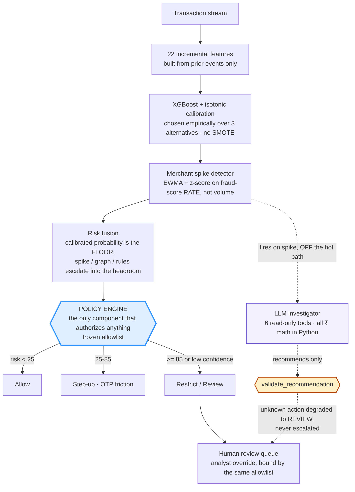

# Fraud Spike Investigator

[](https://razorpay.com/)
[](#honest-limitations)
[](tests/)
[](CLAUDE.md)
[](#real-data-check--our-recipe-someone-elses-data)

> 🎥 **5-min pitch video:** `[TODO: paste link]`
> 🖥️ **Live console:** **https://fraud-spike-investigator.onrender.com/** — or run it locally in one command (below)
> 📄 **Judges:** [SUBMISSION.md](SUBMISSION.md) is the one-page summary mapped to the judging criteria.

**Merchants don't lose money one transaction at a time. They lose it in bursts.** Per-order scorers flag individual bad orders. Nobody tells the merchant *"you are under attack right now, here's why, who's behind it, what it costs, and what to do."*

This closes that loop at the **merchant** level — it sits **above** per-order scoring, complementary to Thirdwatch/Shield rather than competing with them. Defense-only, temporally evaluated, costed in ₹ including the false-positive side.

---

### The finding this project exists to show

We rebuilt every attack with a **different entity graph** — card testing spread
across 25 devices instead of 3, the device farm across 10 instead of 1 — holding
volume, burst window, amounts and account ageing constant, and ran the frozen
pipeline over 5 seeds. Four of the five new shapes are **2.5–10× less
concentrated**, i.e. strictly harder.

| | on the shapes it trained on | on shapes it has never seen |
|---|---|---|
| **Per-transaction model** — confidence inside the attack | card testing **0.758** · IP cluster **0.872** | **0.436** · **0.612** |
| **Merchant-level detector** — attacks caught | **22 / 25** | **21 / 25** |

**Individual orders become ambiguous. The merchant is still visibly under attack.**
That gap is the entire argument for a layer above per-order scoring, and it is a
measurement rather than a claim. *(Account takeover fires only 2/5 even in its
known form here and is reported as weak evidence — the other four families are
5/5.)*

| | |
|---|---|
| Attack merchants detected | **25 / 25** across 5 seeds |
| False alarms | **1 in 35** non-attack merchant-windows (2.9%, 95% CI 0.1–14.9%) |
| Net protected value | **₹8.13L** simulated, after 948 reviews × ₹50 |
| Precision / Recall | **0.996 / 0.735** at the cost-optimal threshold |
| Legitimate merchants built to look like attacks | **3**, two sharing entities — plus a **0→100% sharing sweep** |
| Logged failures with root causes | **35**, including two we had to retract |

**The boundary, stated up front rather than in a footnote:** the merchant-level
layer is validated on **our own generator**. Of the nine datasets in Amazon
Science's fraud-dataset-benchmark exactly one has a merchant identifier; we
measured that one and IBM's 24M-transaction set, and
[neither can evaluate this layer](#we-went-looking-for-public-merchant-data-twice-here-is-what-we-found).
Public data validates the transaction-level methodology only (ULB PR-AUC 0.731,
IEEE-CIS 0.460, zero tuning). **"Prevented" here means simulated exposure
prevented, not revenue recovered.**

---

<details>
<summary><b>Defense-only — including why the attack generator in <code>src/sim/</code> is not an exception</b></summary>

<br>

This repository contains a synthetic data generator that produces labelled
attack traffic — card-testing waves, device farms, IP clusters, account
takeovers, fraud rings. That is the obvious thing to challenge on a
defense-only track, so here is the argument rather than an assertion.

**What it does:** emits rows into a pandas DataFrame with an `is_fraud` label,
so that a supervised model has positives to learn from and the evaluation has
ground truth. Without it there is no training signal and no measurable recall.

**What it does not do, and cannot:**

- It never touches a real system. No network calls, no payment rails, no probing.
- It does not optimize anything. The attack shapes are fixed, hand-written
  topologies — "one device across fifty accounts", "one IP across forty" — the
  kind described in any public fraud-detection paper. There is no search, no
  objective function, no adaptation against a defender.
- It does not model evasion. Nothing in the codebase asks "what would avoid
  detection", and no component consumes the detector's output to modify an attack.
- It discovers no weaknesses. It cannot analyse a real merchant, gateway or
  rulebook, and produces nothing an attacker could act on.

**The output is not attack tooling; it is a labelled dataset.** An attacker
gains strictly less from it than from the published literature it is modelled on.

**And the defensive side is enforced in code, not convention:** the LLM has
seven read-only tools, cannot authorise anything, and any unrecognised
recommendation is degraded to `REVIEW` rather than escalated. Every action comes
from a frozen four-item allowlist that binds the human analyst as tightly as the
model. All of it is pytest-enforced (`tests/test_safety.py`, `tests/test_agent.py`).

</details>

---

## Results at a glance

| | |
|---|---|
| **Attack merchants detected** | **25 / 25** across 5 seeds of the generator |
| **False alarms** | **1 in 35 non-attack merchant-windows** — a legitimate corporate buyer, on one seed. [Tested against three legitimate spikes, two of which share entities](#the-hard-negative-a-legitimate-merchant-built-to-look-like-an-attack) |
| **Net protected value** | **₹8.13L** on the held-out test slice, after 948 reviews × ₹50 |
| **Legitimate ₹ wrongly blocked** | **₹2,575 — 0.024%** of the ₹1.07Cr in legitimate value processed |
| **Precision / Recall** | **0.996 / 0.735** at the cost-optimal threshold |
| **Calibration (Brier / ECE)** | **0.0123 / 0.0074** — measured, not assumed |
| **Same recipe on real public data** | ULB **0.731** PR-AUC · IEEE-CIS **0.460**, zero tuning |
| **LLM safety** | **0/13** policy violations · **0/13** unsafe actions · it cannot authorize anything |

Evaluation is temporal throughout — day-boundary splits, never random. Model selection, threshold tuning and calibration all happen on validation; the test slice is read once, at the end.

**These numbers are lower than earlier versions of this README, twice over, on purpose.** We audited our own generator and found it leaking the label through account age — [fixed, and the cost published](#leakage-self-audit-we-broke-our-own-headline-then-fixed-it). Then we built a legitimate merchant designed to defeat our own entity layer, and [it worked](#the-hard-negative-a-legitimate-merchant-built-to-look-like-an-attack): a shared payment terminal scored **0.972** against a device farm's **0.985**. Both are fixed and both are documented. The headline fell each time and the claim got harder to attack each time.

### Detection speed vs two baselines

Ground-truth attack starts come from the simulator, so "time to detect" is measured, not estimated.

| Scenario | Static volume threshold | Naive flag counter | **This system** |
|---|---|---|---|
| Card testing | not detected | 106m35s | **84m07s** |
| Device farm | **4m34s** | 17m19s | 9m47s |
| IP cluster | not detected | 30m53s | **29m40s** |
| Account takeover | not detected | 228m46s | **144m11s** |
| Fraud ring | not detected | **59m14s** | 67m59s ← *we lose this one* |
| **False alarms** | **6 merchants** — incl. **all three** legitimate spikes | 0 | **0** |

**We report the losses.** The naive flag counter beats us on the fraud ring by 9 minutes. The static volume threshold is fastest on the device farm — because a device farm *is* a volume event — but it misses the other four entirely and **fires on all three legitimate spikes: the flash sale, the corporate buyer and the shared kiosk.** That is the whole argument in one row: volume is not evidence.

---

## How it works



**The LLM is never in the decision path.** It investigates and explains; the policy engine decides. Disabling the agent changes no decision, and that is pytest-enforced. We have a live case where it called a real ₹5.5L account takeover *"legitimate, allow"* at 0.95 confidence and the system restricted 68 transactions anyway.

**Scope.** This targets the burst-fraud loss class. The same machinery — rate-based spike detection over any per-order risk score, with the same policy gate and human queue — extends to RTO/COD and chargeback risk by swapping the scorer; we did not build those, and we don't claim them.

## Quickstart

```bash
pip install -r requirements.txt
python -m src.models.select_model    # compare model families on validation → pick winner
python -m src.policy.threshold_sweep # cost-optimize policy cutoffs on validation
python -m src.models.train           # simulate → features → train → metrics → fusion → spike replay
python -m src.models.ablation        # feature-group ablation table + leakage diagnostics
python -m src.models.leakage_probe   # adversarial self-audit of our own eval (see below)
python -m src.models.seed_stability  # re-run the pipeline across 5 worlds (~6 min)
python -m src.models.real_data_check # same recipe on REAL data (needs a Kaggle download)
python -m src.agent.eval             # 13-case agent eval, 3 held-out (needs ANTHROPIC_API_KEY)
python run_demo.py                   # dashboard + live replay -> http://127.0.0.1:8000
python -m pytest tests/ -q           # safety invariants (124 tests)
```

## Demo — what to watch

`python run_demo.py` trains, serves and replays the 14,160-transaction test slice through the **real** fusion → policy path (not a scripted animation). ~60s at the default 250 txn/s.

1. **Merchants light up in attack order** — card testing (m3), device farm (m5), IP cluster (m7), account takeover (m2), fraud ring (m9). Each card shows peak flagged *rate* and spike *z*, not a single transaction's score.
2. **Click any merchant** to see its entity network. Hover a hub to light up its slice of the graph — one device across 50 accounts is the shape that matters. Account takeover (m2) is deliberately instructive here: it spikes hard and its graph is **empty**, because ATO doesn't share entities.
4. **Investigations fire automatically on spike**, off the hot path. The report shows cause, evidence, ₹ exposure and a recommended action — plus the action the policy engine actually authorized, which is the one that counts.
5. **The review queue accepts analyst overrides** — and rejects an invented action with HTTP 400. The allowlist binds humans exactly as it binds the LLM.
6. **The closing frame: "same spike, opposite verdict."** When the replay ends, a panel puts the device farm (m5) and the flash sale (m11) side by side. The flash sale is the **busier** merchant of the two — 2,284 transactions against 1,041 — and receives **0 restrictions** against 124, because its entity graph is empty while the farm's is one device shared by 50 accounts. Same volume story, opposite structure, opposite decision, rendered from live state.

Flags: `--speed N` (replay rate), `--no-agent` (skip LLM investigations, no API key needed), `--no-browser`, `--port N`, `--host H`.

**Deploying it.** `render.yaml` is a one-click Render blueprint. It installs `requirements-serve.txt` — the same pinned versions as `requirements.txt`, minus LightGBM/CatBoost (only needed to *reproduce* model selection, imported lazily), the agent stack (imported lazily), and the test deps. Boot to a fully replayed board takes about 20 seconds. It deploys with `--no-agent` deliberately: putting an Anthropic key on a public host would let any visitor spend credits through `/api/merchants/{id}/investigate`. Everything except the LLM investigator works without it.

**Serving auth.** Every *mutating* endpoint requires an `X-API-Key`; read endpoints stay open so the state can be inspected with `curl`. Set `FSI_API_KEY` to pin the key, or let the demo mint an ephemeral one at startup and hand it to the page same-origin — either way it stays one command. This is a single-tenant gate, not identity: it stops an unauthenticated caller from overriding an analyst decision, but it does not record *which* analyst acted, and a real deployment needs per-analyst identity for that.

## Model selection

The transaction scorer is a **GBDT, selected empirically** — not a fixed library choice. Before any tuning, four classifiers were trained with **identical class weighting and default hyperparameters** (no per-model tuning) and compared on the temporal **validation slice only** (days 21–23); the test slice is never touched for this decision. Selection rule, fixed *before* looking at results: highest validation PR-AUC wins; if the top GBDTs land within 0.02 PR-AUC of each other, break the tie by speed + maintainability and say so explicitly.

| Model | Family | Val PR-AUC | Train time | Inference time |
|---|---|---|---|---|
| LightGBM | GBDT | **0.7702** | 1.85s | 0.0072s |
| CatBoost | GBDT | 0.7573 | 8.82s | 0.0045s |
| **XGBoost** ← selected | GBDT | 0.7625 | **0.40s** | 0.0068s |
| LogisticRegression | linear | 0.9124 | 0.13s | 0.0008s |

**Winner: XGBoost — and the tie-break is what chose it, not the raw metric.** All three GBDTs land inside the 0.02 margin (0.7573–0.7702), so the pre-declared rule fired: pick by speed + maintainability. XGBoost trains ~4.6x faster than LightGBM and ~22x faster than CatBoost for a PR-AUC difference of 0.0077 — well inside noise for a 6,190-row validation slice. Choosing LightGBM on that gap would be optimizing a rounding error.

This is worth stating plainly because **an earlier version of this table looked completely different** (XGBoost 0.669 / LightGBM 0.656 / CatBoost 0.648 / LogReg 0.511) and XGBoost led on raw PR-AUC. The cause was a methodology bug, not model behavior: the validation slice (days 21–23) originally contained *no attack at all*, only ~0.6% ambient fraud — so validation PR-AUC was measuring "can you rank ambient fraud," not "can you catch an attack," which is what the model is selected to do. Moving one historical device-farm attack into day 22 fixed the slice. The winner survived the change, but the *reason* flipped from "leads on PR-AUC" to "wins the tie-break" — which is exactly why the rule was fixed in advance.

Honest caveat: validation now contains one attack type (device farm), so validation PR-AUC is still a narrow measure. It is used only to rank model families, never to report performance — that comes from the test slice.

Reproduce: `python -m src.models.select_model` → writes `artifacts_out/model_selection.csv` and `artifacts_out/model_selection_decision.json` (the persisted winner — `train.py` and `ablation.py` read this file and never hardcode a library).

## Results (temporal held-out test set, synthetic data — honestly labeled as such)

| Metric | Value |
|---|---|
| Model | XGBoost (empirically selected — see Model selection above) |
| PR-AUC | 0.825 on this seed; **0.862 ± 0.024 across 5 seeds** ([stability](#stability-across-worlds-is-this-a-result-or-one-lucky-seed)) |
| Precision / Recall @ cost-optimal threshold | 0.996 / 0.735 |
| Precision@100 / @500 | 1.00 / 1.00 (stable under adversarial tie-breaking) |
| Fraud ₹ prevented (test slice) | ₹7.86L |
| Legitimate ₹ wrongly blocked | **₹2,575 — 0.024%** of ₹1.07Cr legitimate value processed |
| Attack merchants detected at merchant level | 5 / 5 (card-testing, device farm, IP cluster, ATO, fraud ring) — and **25/25 across 5 seeds** |
| False merchant-level alarms | **1 in 35 non-attack merchant-windows** — a legitimate corporate buyer on one seed. Three legitimate spikes are now tested, two of them sharing entities |
| Brier score / ECE (calibrated) | 0.0123 / 0.00736 — [reliability curve is near-bimodal](#calibration) |
| Human review load | 66.9 cases per 1,000 transactions (6.69%) — [staffing caveat below](#honest-limitations) |

> **This table is deliberately unflattering, in three ways.** First, earlier versions of this README reported PR-AUC **0.934**, then **0.898**. Both came from datasets that were easier than they should have been — the first leaked the label through account age, the second contained no legitimate merchant that shares entities. **Do not read the falling numbers as a regression.** Each drop is a test getting harder, and precision actually *improved* to 0.996 while legitimate ₹ wrongly blocked fell to ₹2,575. Second, our cost model prices a false negative at exactly the fraud amount and nothing else — no chargeback fees, dispute handling, regulatory exposure or churn — which under-weights false negatives and biases the threshold toward blocking *less*, so the false-positive figure is conservative in the direction that **flatters us**. Third, **four training-data configurations were tried** before settling on this one, and we did not pick the best-scoring one. Full stories: [leakage self-audit](#leakage-self-audit-we-broke-our-own-headline-then-fixed-it) and [the hard negative](#the-hard-negative-a-legitimate-merchant-built-to-look-like-an-attack).

### Net protected value — the economics of the *decisions*, not the model

Every test transaction is routed through the actual policy engine (allow / step-up / review / restrict), and each action is costed with documented assumptions (₹50 per human review; 7% of legitimate customers abandon at step-up; 90% of fraud fails step-up):

| | |
|---|---|
| Fraud exposure prevented | **₹8.61L** |
| Legitimate revenue impacted | ₹452 |
| Human review cost (948 cases × ₹50) | ₹47,400 |
| **Net protected value** | **₹8.13L** |
| ₹ protected per ₹ of cost imposed | ~18x |

**How much does this rest on the ₹50 review cost?** Less than it looks. Review
cost is 5.5% of gross prevented at ₹50, so the conclusion survives being badly
wrong about it:

| review cost per case | net protected value |
|---|---|
| **₹50** *(assumed)* | **₹8,13,211** |
| ₹200 (4×) | ₹6,71,011 |
| ₹500 (10×) | ₹3,86,611 |
| **₹908** | **₹0 — break-even** |

**You would have to be wrong by 18× before the answer flips.** That is the useful
form of the question for the REVIEW cost specifically. It does not generalise to
every cost assumption: pricing a *false negative* at 5× the fraud amount moves
the cost-optimal threshold from 0.20 to 0.05 and blocks 23× more legitimate
revenue ([cost curve](#the-false-positive-cost-as-a-curve-rather-than-a-number)).
We previously wrote that cost changes could not move the policy; **that claim is
retracted — it was asserted, then measured, and it was wrong.** What remains true
is narrower: because the fused score distribution is near-bimodal, moving the
REVIEW cost
rescales the headline. The genuinely open question is the one in
[Honest limitations](#honest-limitations): we price a false negative at exactly
the fraud amount and nothing else, which is an under-count in a direction that
*flatters* us, not a knob this table can settle.

(Figures use the validation-optimized step-up cutoff — see Policy thresholds below. Note the two different false-positive figures on this page and why they differ: **₹2,575** is what the *classifier* would block at its threshold; **₹452** is what survives to actually impact revenue after the *policy engine* routes most of it to step-up and human review instead of an outright block. Both are real; the first is the honest headline for model quality, the second for system behaviour.)

This reframes the result from "our model has good metrics" to "our system makes economically sensible risk decisions."

### Risk fusion (P1b) — and the honest result that it changes nothing here

The economics loop originally used `risk_score = p_fraud * 100, confidence = 0.85`. That shortcut discarded every signal except the ML probability — the spike z-score, entity-graph structure, and rule hits were all computed and then thrown away — and because confidence was a hardcoded constant, the policy engine's low-confidence escalation branch was unreachable dead code.

`src/policy/fusion.py` replaces it with an explicit, linear, bounded fusion: the calibrated ML probability sets a **floor**, and corroborating context (spike 0.50 / graph 0.30 / rules 0.20, scaled by a 0.6 lift factor) escalates into the headroom above it. Confidence is computed from signal **agreement**, so a high ML score with nothing corroborating comes out *less* confident and routes to a human rather than an automatic restrict.

**Fusion has changed from a no-op into something that does work — and the trajectory is the argument.** On this dataset it changes **433 of 14,160 decisions (3.1%)**.

| dataset version | decisions changed by fusion |
|---|---|
| leaky generator | **0 of 13,987** — literally nothing |
| generator fixed | 3 of 13,782 (0.02%) |
| **+ hard negatives** | **433 of 14,160 (3.1%)** |

This is exactly what the architectural argument below predicted, three years' worth of it in three runs: **the value of corroboration scales with how much genuine ambiguity the problem contains.** On data where two features encoded the label there was nothing for it to do. Add merchants whose entity structure is attack-shaped but whose traffic is honest, and the mid-band fills up — which is precisely where a floor-plus-context design earns its keep.

We kept fusion when it changed nothing and said so plainly. We are reporting the change now on the same terms.

Fusion is kept anyway, and on architectural grounds only — stated plainly rather than dressed up as a metric win:
- **Auditability.** Every decision now carries a per-signal breakdown (`artifacts_out/fusion_scores.csv`) — the "why this score" the P2 investigator and P3 dashboard need.
- **A reachable fail-safe.** The low-confidence branch is now live rather than dead code (pytest-enforced), and ML-unavailable reaches `decide()` as `risk_score=None` so the documented fail-safe fires instead of a context-only score that would understate risk.
- **Headroom for a weaker model.** The value of corroboration scales with model uncertainty; a system running a less separable model, or facing a novel attack the model scores poorly, is where this layer earns its place.

Two bugs found and fixed while building it, both caught by measurement rather than review: (1) the first implementation was a plain weighted average, which capped a `p=1.0` transaction at risk 60 — silently overruling the calibrated model it was supposed to defer to; (2) `COMPONENT_SATURATE=15` handed a full graph-risk bonus to **26% of legitimate transactions**, because ordinary customers already sit in entity components of ~10 via shared ISP IP pools. The graph signal now measures *excess* over the ordinary population, with both constants derived from the train slice only (legit p99 = 25, fraud p90 = 120); legit mean risk dropped 9.02 → 0.67.

### Time-to-detect: how fast do we know a merchant is under attack?

Ground-truth attack start times come from the simulator. Three systems compared — a static volume threshold (2x mean hourly volume), a naive flag-counter (alarm on the 10th model-flagged transaction), and our streaming spike detector (≥8 high-risk among the merchant's last 30 transactions within a bounded span):

| Scenario | Static volume | Flag counter | **Streaming spike** |
|---|---|---|---|
| Card-testing wave | not detected | 62m47s | **55m22s** |
| Device farm | 3m59s | 21m54s | **19m18s** |
| IP cluster | not detected | **26m15s** | 31m03s |
| Account takeover | not detected | 53m38s | **53m30s** |
| Fraud ring | not detected | 100m49s | **69m37s** |
| **False alarms** | **5 merchants (incl. flash sale)** | 0* | **0** |

*The flag-counter shows zero false alarms only because the test window is 6 days — it has no time or rate context, so ambient fraud drip-accumulates flags and it must eventually cry wolf on ordinary merchants; the streaming detector's rate + span guards make that structurally impossible. The static volume threshold, meanwhile, flags the flash sale (it cannot tell a sale from an attack) while missing 4 of 5 real attacks.

Streaming spike beats the naive flag-counter on 4 of 5 scenarios (largest margin: account takeover, 144m vs 229m) and **loses on the fraud ring, 68m vs 59m** — reported, not smoothed over. The static volume threshold wins only on the device farm, misses the other four, and flags all three legitimate spikes.

## Ablation study

How much does each feature group — and the merchant-level spike/policy layer on top of the classifier — actually contribute? Same temporal split, same calibration and cost-optimal-threshold procedure as above, evaluated on the test slice, using the empirically-selected model (XGBoost):

| Stage | Features | PR-AUC | 95% CI | Precision | Recall | Fraud ₹ prevented | Legit ₹ wrongly blocked |
|---|---|---|---|---|---|---|---|
| 1. basics | 6 | 0.629 | — | 1.000 | 0.550 | ₹4.14L | ₹0 |
| 2. + velocity | 12 | 0.611 | — | 0.847 | 0.609 | ₹5.39L | ₹51.8K |
| 3. + entity/graph (full 22) | 22 | **0.825** | — | 0.996 | 0.735 | ₹7.86L | ₹2.6K |
| 4. full system (+ spike/policy layer) | 22 | 0.825 | — | — | — | — | — |

**Are those steps real, or noise?** Measured, not asserted — a *paired* bootstrap
over 2,000 resamples of the test slice, every variant scored on the same resampled
rows (`python -m src.models.ablation_ci`):

| step | Δ PR-AUC | 95% CI | verdict |
|---|---|---|---|
| basics → + velocity | −0.0181 | [−0.0453, +0.0079] | **not distinguishable from zero** |
| + velocity → + entity/graph | **+0.2138** | [+0.1748, +0.2517] | significant |
| basics → full 22 | **+0.1957** | [+0.1587, +0.2334] | significant |

The entity/graph step clears zero comfortably. The velocity step does not. This is *sampling* uncertainty over one test slice; the
five-seed spread below measures generative variance, and the two are
complementary. Neither is real-world variance.

Stage 4 isn't a bigger feature set — stage 3 already uses all 22 features. It replays stage 3's calibrated scores through the merchant `StreamingSpikeDetector` + policy engine and reports **5/5 attack merchants caught, 0 false alarms on this seed, and all three legitimate spikes correctly not flagged** — i.e. what the spike/policy layer adds on top of a strong per-transaction classifier (merchant-level, actionable detection), which raw PR-AUC alone doesn't capture.

**A claim retracted, then re-established — read this before reading the jump.** An earlier version of this section claimed "entity/graph features are where the system actually comes from." We then attacked our own evaluation and found the attribution was **wrong**: the stage-3 bucket mixes entity *correlation* (device/IP/instrument fan-out, graph component size) with per-customer *profile* (`customer_age_days`, `amount_dev_ratio`), and under the old generator that profile pair was close to a label encoding. The claim was retracted.

**We then fixed the generator and re-ran it.** On data that no longer hands out the answer, the original claim turns out to be **true**, and now it is measured rather than assumed. The diagnostic rows below are produced by the same `ablation.py` run, and its verdict line is *derived from these numbers*, not hardcoded — see [Leakage self-audit](#leakage-self-audit-we-broke-our-own-headline-then-fixed-it).

| Diagnostic (not a ladder stage) | Features | PR-AUC | Precision | Legit ₹ wrongly blocked |
|---|---|---|---|---|
| D1. profile pair only (`customer_age_days`, `amount_dev_ratio`) | 2 | 0.5970 | 0.593 | ₹144.1K |
| D2. entity *sharing* only (device/ip/instrument counts + component size) | 4 | **0.3950** | 0.654 | **₹187.7K** |
| D3. full 22 minus the profile pair | 20 | **0.7663** | 0.998 | ₹3.2K |

The profile pair now scores **0.5970 against the full set's 0.8248** — a gap of 0.2278, where it used to be 0.0016. Dropping the pair entirely costs 0.0585. And entity structure is now the strongest single signal in the model:

| Top single features (each alone, same recipe) | PR-AUC |
|---|---|
| `component_size` | **0.7112** |
| `device_account_count` | 0.7025 |
| `ip_account_count` | 0.7010 |
| `geo_mismatch` | 0.5604 |
| `amount_dev_ratio` | 0.4939 |
| `customer_age_days` | 0.3590 |

**Entity correlation is where the system comes from** — a claim we retracted when it was unsupported and are restating only because harder datasets keep supporting it. The step is **+0.2138, 95% CI [+0.1748, +0.2517]**.

**But entity sharing alone is necessary, not sufficient — and we can now put a number on the difference.** Under an earlier version of this table, D2 (entity sharing only) scored **0.7877 with precision 1.000 and ₹0 wrongly blocked**, which made it look almost sufficient on its own. Then we added a [legitimate merchant that shares entities](#the-hard-negative-a-legitimate-merchant-built-to-look-like-an-attack), and D2 collapsed to **0.3950, precision 0.654, ₹187.7K of legitimate value blocked.**

That is the entire point of the hard negative. *On easy negatives, entity-sharing reasoning looks sufficient. On hard ones it starts blocking honest money.* The full feature set is what separates a shared payment terminal from a device farm — and it is also the quantitative twin of [failure 16](#failure-recovery), where the agent reasoned only from entity sharing and called a real ₹5.5L takeover legitimate.

**Velocity is small and its sign is not stable — we have now measured it three times and got three answers.** Under the leaky generator it was a mild regression. After the generator fix it was **+0.0317 [+0.0189, +0.0445]**, significant. After the hard negatives it is **−0.0181 [−0.0453, +0.0079]**, which spans zero.

The honest reading is not any one of those numbers, it is the pattern: **this step is small enough that the dataset decides its sign.** Rolling-window counts spike for busy *legitimate* merchants too, so without entity history to tell "one device across 50 throwaway accounts" from "a popular merchant having a good hour", velocity adds about as much noise as signal. We report the interval rather than whichever sign the current run produced — that is what the interval is for.

*A retracted claim, kept visible on purpose.* An earlier version of this section reported a dramatic stage-2 **collapse** (PR-AUC 0.55 → 0.23, legit ₹ blocked 6x) and explained it as "velocity alone is a trap." That was an artifact, not a finding: with no attack in the calibration slice, isotonic calibration had almost nothing to fit and produced degenerate score plateaus. Once validation contained a real attack (see Model selection), the effect shrank to −0.03 — a mild regression, not a collapse. A follow-up diagnostic on the top-200 scored transactions initially seemed to confirm the story (18 flash-sale transactions ranked as top fraud risk under the velocity-only model), but that too dissolved under scrutiny: the top-200 sits entirely inside a ~447-transaction tie-plateau where every score is exactly 1.0, so its composition was decided by row order. Re-ranking the same plateau by raw model score gives **zero** flash-sale transactions and precision 1.000 for all three variants. The feature slicing was verified correct (a clean 6/6/10 partition of all 22 features), so there was no bug to fix — the diagnostic simply could not support the claim. Both the original finding and its retraction are left here because "we chased a dramatic result and it did not survive" is the honest version of this table. **And it has a third act:** after the generator fix (see the leakage self-audit), the same step turned *positive* and significant. A claim we published, retracted, and then had to revise a second time in the other direction — which is what it looks like when the measurement, not the narrative, decides.

Reproduce: `python -m src.models.ablation` → writes `artifacts_out/ablation_table.csv`.

## The hard negative: a legitimate merchant built to look like an attack

For most of this project, "0 false alarms" rested on **one** negative — a 6×
flash sale. Re-reading how it is built shows the problem:

```python
cid = int(rng.integers(0, w.n_customers))
r = _base_txn(w, rng, t, merchant, cid)   # each customer gets their OWN device/IP/card
```

Every flash-sale account has its own entities *by construction*. So that
scenario only ever tested one thing — **does raw volume fire us?** — and never
touched the entity layer at all. m11's entity graph renders empty.

Which leaves the first question a risk person actually asks: **what about a
corporate office where fifty people share one IP, or a shop counter where
everyone pays through the same terminal?**

### Two merchants that should break us

Both are legitimate (`is_fraud = 0`) and both are built from **real world
customers** — aged accounts, their own normal amounts — so **entity sharing is
the only thing that differs from ordinary traffic.** A false alarm on either
cannot be blamed on account age or amount.

| scenario | shape | mirrors |
|---|---|---|
| **s7 corporate buyer** (m4) | 40 accounts, **1 office IP**, 2 company cards, own devices, spread over a working day | `s3_ip_cluster` |
| **s8 shared kiosk** (m10) | 25 accounts, **1 device**, 1 IP, each customer's own card, compressed into 2 hours | `s2_device_farm` |

### It worked. The system failed.

| scenario | mean score | % scored ≥ 0.5 | truth |
|---|---|---|---|
| **s8 shared kiosk** | **0.972** | **97.2%** | **legitimate** |
| s2 device farm | 0.985 | 98.5% | attack |
| **s7 corporate buyer** | 0.052 | 0.5% | legitimate |
| s6 flash sale | 0.003 | 0.0% | legitimate |

**A legitimate payment terminal scored 0.972 against a device farm's 0.985.**
Peak spike z was **5.34 on the kiosk against 5.33 on a real IP-cluster attack** —
the honest merchant produced a *higher* z than the fraud. It was restricted,
₹1,24,285 of legitimate revenue was impacted, and PR-AUC fell to 0.695.

The corporate buyer passed comfortably (z 1.10). **Shared entities were not the
problem — a shared *device* was.**

### Root cause: a gap in the training distribution, not a missing feature

The signal that separates the two was already being computed. In a farm, 50
accounts share ~8 instruments; in a kiosk, 25 accounts use 25 of their own
cards — `instrument_customer_count` tells them apart.

The model had simply never been given a reason to use it: **the training period
contained shared-device fraud and no shared-device honest traffic.** It learned
"shared device = fraud" because in this world it always had been. Same shape as
[failure 1](#failure-recovery) (attacks only in test) and failure 6 (no attack
in the calibration slice).

**Fix:** a legitimate kiosk in the *training* period — different merchant,
different day, entity IDs pytest-verified disjoint from the held-out one. The
same discipline the five attack scenarios already use.

| | broken | **fixed** | control |
|---|---|---|---|
| Kiosk mean score | 0.972 | **0.002** | |
| Kiosk % flagged | 97.2% | **0.0%** | |
| Kiosk peak z | 5.34 (fired) | **0.00** | |
| Device farm mean score | 0.985 | 0.982 | ← unchanged |
| IP cluster mean score | 0.922 | 0.909 | ← unchanged |

All five attacks still fire. Precision *improved* to 0.996 and legitimate ₹
wrongly blocked fell to ₹2,575.

### What we did not fix, and why

The corporate buyer still false-alarms **on one seed out of five** — measured
across all five, not spot-checked (`false_alarm_merchants` in
`artifacts_out/seed_stability.csv`). One event in 35 non-attack
merchant-windows is **2.9%, 95% CI [0.1%, 14.9%]** — a wide interval on a small
sample, and quoting the point estimate alone would overstate it.

The symmetric fix is obvious: teach the model that a shared *IP* can be honest
too. **We measured it rather than reasoning about it**, and the first
measurement was misleading. On seed 7 it removes the false alarm and raises NPV
to ₹9.47L against our ₹8.13L — so for a while this section said we were
*overriding* our own cost rule on failure-severity grounds. **An outside
reviewer pointed out that a win on one seed and a catastrophic failure on
another is not a comparison.** They were right. Run across all five seeds
(`python -m src.policy.config4_npv`):

| | mean NPV over 5 seeds | attacks caught |
|---|---|---|
| **shipped configuration** | **₹9,39,179** | **25 / 25** |
| rejected configuration | ₹8,74,988 | 24 / 25 |

**The apparent NPV advantage was a seed-7 artifact.** Averaged properly the
rejected configuration is **₹64,192 worse** *and* loses an attack — on seed 101
it drops card-testing detection to a mean score of 0.004. There is no
money-versus-safety trade here at all; it is simply worse on both axes, and we
only thought otherwise because we had compared one seed in a project that keeps
a five-seed harness precisely to prevent that.

We still cannot explain *why* corporate-buyer examples destabilise card
testing, so the false alarm stays and is documented rather than fixed by a
change we do not understand. The rejected configuration is left **reachable**
(`HIST_CORPORATE_BUYER` in the simulator) so anyone can re-measure it.

**We tried four configurations in total** — that number matters more than any
one result.

Reproduce: `python -m src.models.seed_stability`, and `pytest tests/test_hard_negatives.py`.

---

### Three points are not a distribution — so we swept the continuum

An outside audit made the sharpest criticism this project has received. Our
three legitimate merchants are three **points**. The detector's entire thesis is
that entity sharing is suspicious, and we had never measured what happens
*between* "shares nothing" and "shares everything". If the false-positive rate
climbs steeply somewhere in the middle, then "0 or 1 false alarms" is a fact
about where our three examples happen to sit — not a property of the system.

So we measured it. Legitimate merchants whose **only** varying property is the
share of their traffic flowing through one device/IP, swept 0% → 100%, run
through the **frozen pipeline** — shipped model, shipped calibration, shipped
cutoffs, no retraining at any point — across the same five seeds the rest of
this page uses. 60 legitimate merchant-seeds in total.

| Traffic through one shared entity | Kiosk (shared device + IP, 2h burst) | Corporate (shared IP, 9h day) |
|---|---|---|
| | mean flagged · seeds fired | mean flagged · seeds fired |
| **0%** | 0.000 · **0 / 5** | 0.001 · **0 / 5** |
| **20%** | 0.016 · **0 / 5** | 0.010 · **0 / 5** |
| **40%** | 0.010 · **0 / 5** | 0.011 · **0 / 5** |
| **60%** | 0.016 · **0 / 5** | 0.013 · **0 / 5** |
| **80%** | 0.023 · **0 / 5** | 0.017 · **1 / 5** |
| **100%** | 0.021 · **1 / 5** | 0.018 · **1 / 5** |
| **positive control** — a real device farm, same volume and window | **0.959 · 5 / 5** | |

**The control matters more than any legitimate row.** A sweep whose control
cannot fire measures the harness, not the system — that is the invalid-null trap
we documented for IEEE-CIS. Ours fires on 5/5 seeds at a mean flagged rate of
**0.959**, against a worst-case legitimate **0.067**.

**The finding, stated as the numbers give it:**

- **3 of 60** legitimate merchant-seeds fired — all of them at **80% sharing or
  above**. Every one of the 40 merchant-seeds below that level fired **zero**
  times.
- **₹0 of legitimate revenue was restricted anywhere in the sweep.** These were
  **alerts, not blocks**: a merchant entered spike state and none of its
  transactions were actually restricted. That is the fail-safe doing its job,
  and it is why "false alarm" and "merchant loses money" are different rows in
  this README.
- The rate does **not** climb through the middle. It is flat at zero until
  traffic is overwhelmingly funnelled through a single entity.

**Why it is flat rather than rising:** training contains an *honest* shared-device
merchant, added when the kiosk broke us. Heavy sharing now reads as the kiosk it
was taught rather than as a farm. The fix from the hard-negative work is what
makes the middle of this curve safe, which is a nicer result than we expected
and is the reason we can show the curve at all.

**What this does and does not settle.** It retires the specific objection that
our three discrete negatives were hiding a cliff between them — they were not.
It does **not** license "the system never false-alarms": the main world's
corporate buyer still fires on 1 seed in 5, and this is our own generator's
topology with one event per merchant. The edge is real, it sits at the extreme
end of the range, and it costs **review capacity rather than merchant revenue**.

Reproduce: `python -m src.models.sharing_sensitivity` · construction guarded by
`tests/test_sharing_sweep.py` (8 tests).

---

### Does it detect coordinated fraud, or only the shapes we drew?

The last criticism our own data can answer, and the sharpest one. Our five
attacks are five **topologies**. The model has only ever been tested against the
shapes it was trained on — so if detection collapses when the shape changes
while the crime does not, the merchant-level result is a fact about our
generator rather than about fraud.

So we held **everything else constant** and varied only the entity graph.
Transaction count, burst window, amount distribution, account ageing and fraud
prevalence are matched between each pair; the only difference is who shares what
with whom. Frozen pipeline — shipped model, calibration and cutoffs, no
retraining — across 5 seeds, with the **known topologies rebuilt with fresh
entity IDs as a positive control**.

| Attack | known | unseen variant | concentration |
|---|---|---|---|
| Card testing | 3 devices / 2 IPs | **25 devices / 20 IPs** | 60 → 7.2 txn per device — **8× diluted** |
| Device farm | 1 device, 50 accounts | **10 devices / 6 IPs, partial overlap** | 130 → 13 — **10× diluted** |
| IP cluster | 40 accounts on 1 IP | **6 rotating IPs** | **6× diluted** |
| Fraud ring | dense 15 acct × 4 dev | **sparse bipartite, 30 acct × 2 of 20 dev** | 30 → 12 — **2.5× diluted** |
| Account takeover | 25 unique devices | 5 shared proxy devices | *concentrated — easier* |

**Four of the five unseen variants are strictly harder than the originals.**

| | detected | mean flagged rate inside the attack |
|---|---|---|
| **known** (control) | **22 / 25** | 0.815 |
| **unseen** | **21 / 25** | **0.709** |

**The merchant layer holds. The transaction scorer does not — and that gap is
the actual finding.** Every one of the four harder variants was still caught
**5/5**, while per-transaction confidence fell sharply on exactly the families
whose fan-out was removed: card testing **0.758 → 0.436**, IP cluster
**0.872 → 0.612**.

That is this product's thesis appearing as a measurement rather than a claim.
The argument for a merchant-level layer is that it survives what per-order
scoring finds ambiguous, and here the per-order model loses confidence while the
merchant-level spike still fires.

**Three caveats, stated before anyone else states them:**

1. **The control is uneven.** Account takeover fires only **2/5 even in its
   known form** here, because ATO is diffuse by construction — ~75 fraudulent
   transactions spread across 22 hours never reaches the streaming detector's
   rate-within-a-window bar on a merchant doing 200/day. **Both** of its rows are
   weak evidence, and we did not tune the window until it fired. The other four
   families have 5/5 controls.
2. **Each variant degrades one signal, not all of them.** Card testing keeps its
   novel instruments; the device farm keeps shared instruments. A determined
   adversary would degrade several signatures at once, and this experiment does
   not simulate that.
3. **Five topologies, one variant each, our generator, 5 seeds.** It shows the
   result is not brittle to *these* changes — not that it holds for every
   coordination pattern someone might invent.

Reproduce: `python -m src.models.topology_generalisation` · construction guarded
by `tests/test_topology_generalisation.py` (27 tests), which assert the pairs are
matched on volume, window, prevalence and amounts, that the topology genuinely
differs, and that the unseen variants are not quietly *easier*.

---

### The false-positive cost, as a curve rather than a number

Track 02 asks for honest metrics *including false-positive cost*, and we were
reporting a single point on a curve we had already computed. One number invites
the fair question "why that one?" — and the answer is a shape.

| threshold | precision | recall | legit ₹ blocked | fraud ₹ missed | expected loss |
|---|---|---|---|---|---|
| 0.05 | 0.808 | 0.790 | ₹76,662 | ₹1,01,606 | ₹2,12,918 |
| 0.10 | 0.984 | 0.760 | ₹3,455 | ₹1,29,212 | ₹1,60,067 |
| **0.20** | **0.987** | **0.760** | **₹3,291** | **₹1,29,212** | **₹1,59,803** ← cheapest |
| 0.50 | 0.994 | 0.745 | ₹2,946 | ₹1,57,207 | ₹1,86,703 |
| 0.70 | 0.996 | 0.736 | ₹2,575 | ₹1,69,125 | ₹1,97,901 |
| 0.99 | 0.996 | 0.735 | ₹2,575 | ₹1,70,289 | ₹1,99,015 |

**This is reporting, not tuning.** The shipped cutoffs are derived on the
*validation* slice and stay there; nothing on this page feeds back into them.

**It also corrected one of our own claims.** Our notes said a cost sweep would
"rescale the headline without moving the policy." Measured, expected loss varies
**33.2%** across the range — and the false-negative price is load-bearing:

| FN priced at | cheapest threshold | legit ₹ blocked |
|---|---|---|
| 0.5× – 2× the fraud amount | 0.20 | ₹3,291 |
| **5× – 10×** | **0.05** | **₹76,662** |

Price a missed fraud at 5× its face value — adding chargeback fees, dispute
handling, regulatory exposure and churn, all of which a real issuer carries —
and the optimum jumps to a far more aggressive threshold that blocks **23× more
legitimate revenue**. [Failure-log 23](CLAUDE.md) named the FN price as our
weakest assumption and we had answered it by assertion. **The claim is
retracted.**

**Two break-even figures, kept apart on purpose:** ₹908/case on the *policy*
path (the published figure, now artifact-backed) and ₹1,498/case on the
*classifier* path. Different denominators, both real — quoting one against the
other is the error [failure-log 31](CLAUDE.md) records.

**What this does not show:** robustness on real traffic. A tame middle is a
symptom of a cleanly separated dataset — 13,612 of 14,160 transactions score
inside [0.0, 0.1]. On ULB, where scores genuinely spread out, the cost-optimal
action was to **block nothing at all**.

Reproduce: `python -m src.policy.cost_curve`

---

## What order should the queue be worked in?

A review queue only matters if the analyst runs out of time before it runs out
of cases — ours produces 948 cases on a 14,160-transaction slice, so it always
will. Under that constraint the **order** is a policy decision worth as much as
the threshold, and ours was never chosen: the serving layer appended cases as
they arrived and the dashboard showed the newest first. Arrival order has no
relationship to money at all.

Measured (`python -m src.policy.queue_order`) — share of the queue's ₹744,217
of fraud value put in front of an analyst, by how many cases they get through:

| cases worked | arrival *(what we shipped)* | by risk score | **by expected loss** |
|---|---|---|---|
| 50 | 5.7% | 5.4% | **47.3%** |
| 100 | 10.0% | 9.7% | **63.2%** |
| 240 *(one analyst-day)* | 69.2% | 41.6% | **82.0%** |
| 400 | 72.1% | 82.2% | **92.8%** |

**The obvious fix is worse at the capacities that matter.** Ranking by risk score —
the first thing anyone reaches for — is *below arrival order* up to ~240 cases,
and only overtakes it once an analyst is working most of the queue anyway. Fusion's
`risk_score` is an escalation scale, not a probability: high scores cluster on
cheap card-testing transactions while the expensive account-takeover cases score
lower. Multiplying rupees by it would be a category error, so expected loss uses
the **calibrated** probability instead: `amount × p`.

Now ranked, and the sort key is on the wire (`ordering: expected_loss_desc`) and
pytest-locked, because it is policy rather than presentation.

**One honest caveat about that table.** Arrival order looks respectable at 240+
cases for a reason that would not survive production: the biggest attacks in
this slice happen to fall near its end, so "newest first" accidentally surfaces
them. The low-capacity rows — 5.3% against 45.0% — are the ones that generalise.

---

## Leakage self-audit (we broke our own headline — then fixed it)

Every number in this repo is measured on data we generated ourselves. That makes one failure mode structurally likely: **the simulator can encode the label into a feature, and the model then scores well by reading our own answer key rather than by detecting fraud.**

We already found one instance at the *agent* layer — entity IDs were self-labelling (`pi_STOLEN_*`, `d_FARM_F`), and hashing them cost us 10/10 → 5/10 correct-cause (failure-log 19). `src/models/leakage_probe.py` runs the same attack one layer down, against the ML evaluation. **It found something, and we published it before we could fix it.**

### What the audit found (the old generator)

| Feature set | n | PR-AUC |
|---|---|---|
| Full 22 (the old headline) | 22 | 0.9344 |
| **`customer_age_days` + `amount_dev_ratio` only** | **2** | **0.9328** |

Two features reproduced the twenty-two-feature headline to within **0.0016**. The cause was the generator, not the model: attack accounts were created **on the attack day**, giving median ages of 0.98–5.65 days against a legitimate baseline of **215.76** — so "account younger than ten days" was very nearly the label. Ambient fraud was `legit_amount × uniform(1.5, 4.0)`, making `amount_dev_ratio` a second proxy. Between them the two features partitioned the label space.

### What we did about it

Two edits, both grounded in real-world fact rather than in what would make the number look better:

1. **Attack accounts are no longer all newborn.** Their ages come from a mixture — a share aged exactly like the legitimate population, because **real fraudsters buy aged accounts** (the case we never generated); the rest genuinely new, because throwaway guest checkout is also real. The shares were fixed on stated rationale *before* measuring and not tuned afterwards.
2. **Fraud amounts are no longer uniformly expensive.** ULB's real card fraud runs **0.42×** the median legitimate amount while IEEE-CIS e-commerce fraud runs **1.10×** — fraud amount is *fraud-type dependent*, and we had modelled only the expensive case.

### The result

| | before | after |
|---|---|---|
| Full 22 features | 0.9344 | **0.8981** |
| **The two proxies alone** | **0.9328** | **0.5997** |
| **Gap** | **0.0016** ← the problem | **0.2984** ← closed |
| Full minus the proxies | 0.8777 | 0.8105 |
| Entity sharing alone | 0.8286 | 0.7877 |

Median attack-account age moved from 0.98–5.65 days to **34–139 days**, overlapping the legitimate distribution instead of separating from it. **The headline fell 0.036. The shortcut fell 0.333.**

### "Isn't your new choice just as arbitrary?"

The fairest attack on this fix, so we measured it rather than argued about it (`src/models/aged_share_sensitivity.py`):

| aged_share | full 22 | proxies alone | gap | median attack age |
|---|---|---|---|---|
| **control** (both fixes reverted) | 0.9334 | **0.9162** | **+0.0172** | 7.0d |
| 0.3 | 0.9031 | 0.7179 | +0.1852 | 9.8d |
| 0.5 | 0.9013 | 0.6477 | +0.2536 | 74.1d |
| 0.7 | 0.8975 | 0.5761 | +0.3214 | 168.9d |
| 0.9 | 0.8983 | 0.4786 | +0.4197 | 220.2d |

**Not load-bearing.** Across the whole range the proxy pair never comes within 0.02 of the full set, and full-set PR-AUC moves only **0.0056**. Any realistic ageing removes the leak; our specific value is not what did it. The control — which reverts *both* generator fixes — reproduces the leak as it should, which is how we know the sweep measures what it claims to.

The old value (100% newborn) was a judgement call too. It was just an implicit one, never examined, and load-bearing enough to fake a headline.

*This sweep caught itself first.* Its original control reverted only the ages, not the amounts, so it did **not** reproduce the leak — and its derived verdict printed "this sweep may not be measuring what we think it is" rather than reporting a clean pass. We fixed the control rather than the wording.

### What the fix cost, and what it did not touch

**Cost, as measured at the time:** PR-AUC 0.945 → 0.910 across 5 seeds. Net protected value ₹10.57L → ₹7.95L. Legitimate ₹ wrongly blocked ₹5,901 → ₹21,728. (All four of those figures have since moved again — [the hard negative](#the-hard-negative-a-legitimate-merchant-built-to-look-like-an-attack) made the dataset harder a second time. They are kept here as the cost of *this* fix, measured against what preceded it.) Time-to-detect swapped which scenario we lose (we now win IP cluster, lose the fraud ring). The hourly EWMA detector now misses the account takeover on seed 7, while the streaming detector — the one the product runs — still catches 5/5 in all five seeds.

**Untouched, as measured at that time:** 25/25 attacks caught, **0 false alarms in 35 non-attack merchant-windows** (this became **1 in 35** one generation later, when the hard negatives were added), flash sale flagged 0/5, P@100 and P@500 both 1.00. ECE slightly improved. The pipeline's leakage *hygiene* was never in question either — features are still built strictly incrementally from prior events, splits are still on day boundaries, calibration still fits only on days 21–23. This was always a **data-construction** problem, not train/test contamination.

### The bugs the re-run exposed

Re-running everything on harder data surfaced three latent bugs that the old data structurally hid:

1. **`threshold_sweep.py` crashed.** Its per-parameter adoption rule assumed each cutoff can move independently, but the grid requires `step_up < restrict` — so the new best pair's one-at-a-time point simply doesn't exist. It now reports "not independently evaluable" and keeps the conservative default.
2. **`leakage_probe.py` hardcoded its failing conclusion.** After the fix it printed *"two features reproduce the headline"* directly above its own output showing they don't.
3. **`ablation.py` did the same thing.**

Both verdicts are now **derived from the numbers**. An audit tool that cannot report a pass is not an audit tool — and we had two of them.

Reproduce: `python -m src.models.leakage_probe` and `python -m src.models.aged_share_sensitivity`.

## Calibration

We route on these probabilities — the policy engine reads risk as a function of `p`, and the cost-optimal threshold is chosen in probability space — so "p = 0.8 means roughly 80%" is measured rather than assumed.

| Metric | Value |
|---|---|
| Brier score (calibrated) | **0.0123** |
| Brier score (raw, uncalibrated) | 0.01468 |
| Expected calibration error (10 equal-width bins) | **0.00736** |

Isotonic calibration measurably helps (Brier 0.01468 → 0.0123). **But the reliability curve is near-bimodal:** 13,612 of 14,160 test transactions fall in [0.0, 0.1], leaving a few hundred spread across the middle. Calibration is measurably worse than before the hard negatives (ECE 0.0031 → 0.0074) — the merchants that sit near the boundary are exactly the ones a calibrator finds hardest. Two consequences we state rather than hide: (1) the low ECE is dominated by the two extreme bins and says little about the middle of the range, where the bins are visibly off — the [0.3, 0.4] bin observes a 0.571 fraud rate against a predicted 0.333, on n=21; (2) that bimodality is the calibration-side signature of the same separability documented in the leakage self-audit — a problem this cleanly separated does not produce a well-spread probability distribution.

Reproduce: `python -m src.models.train` → writes `artifacts_out/calibration_curve.csv`.

## Stability across worlds (is this a result, or one lucky seed?)

Every headline number above comes from seed 7 — a single simulated world, n=1. That is not enough to justify four decimal places. So we re-ran the **entire** pipeline (simulate → features → temporal split → train → isotonic → cost-optimal threshold → merchant-level replay) across five seeds, fixed in advance, with all five reported.

**These are five seeds of the same generator, not five independent worlds.** The scenario definitions are identical; only the sampling changes. This controls for seed luck — which is real and worth controlling for — and nothing more.

| Seed | PR-AUC | Precision | Recall | Attacks caught | False alarms | Flash sale flagged |
|---|---|---|---|---|---|---|
| 7 *(the README's seed)* | 0.8248 | 0.996 | 0.735 | 5/5 | none | No |
| 11 | 0.8541 | 0.982 | 0.761 | 5/5 | **m4** | No |
| 23 | 0.8860 | 0.900 | 0.861 | 5/5 | none | No |
| 42 | 0.8757 | 0.966 | 0.793 | 5/5 | none | No |
| 101 | 0.8689 | 0.984 | 0.785 | 5/5 | none | No |

**PR-AUC = 0.862 ± 0.024 (range 0.825–0.886).** Seed 7 is the *worst* of the five, so the README under-reports rather than cherry-picks — read it as "about 0.86", not 0.8248. The spread is three times wider than before the hard negatives, which is itself the finding: those merchants are close to the decision boundary, so where exactly they land moves with the seed.

**The merchant-level claims mostly hold up, and the exception is named:** across five seeds, **25/25 attack merchants detected**, the flash sale flagged **0 / 5**, and **1 false alarm in 35 non-attack merchant-windows** — a legitimate corporate buyer on seed 11. Attack detection survived both the generator fix and the hard negatives entirely unchanged; the false-alarm claim did not, and [the reason it is still 1 rather than 0 is a deliberate trade](#the-hard-negative-a-legitimate-merchant-built-to-look-like-an-attack).

Reproduce: `python -m src.models.seed_stability` → writes `artifacts_out/seed_stability.csv` and `seed_stability.json`. (Seed 7 reproducing 0.8248 exactly also serves as a determinism check on the whole pipeline.)

## Real-data check — our recipe, someone else's data

Everything above is measured on data we generated, and [Leakage self-audit](#leakage-self-audit-we-broke-our-own-headline-then-fixed-it) showed what that can hide. So we ran the **same recipe, unchanged**, against **two** real public fraud datasets:

- **ULB `creditcardfraud`** — 284,807 real card transactions, **0.173% fraud**, 30x more imbalanced than our synthetic 5.1% and therefore a far harder test of class weighting and calibration than our own data provides. No entity columns.
- **IEEE-CIS (Vesta)** — 590,540 real e-commerce transactions, **3.5% fraud**, *with* card/address/device columns, so it can test the entity claim directly.

`cost_optimal_threshold` and `calibration_report` are **imported from `train.py`**, not reimplemented, so there is exactly one definition of each measurement.

| Tier | Features | PR-AUC | ROC-AUC | Brier |
|---|---|---|---|---|
| Amount + time only | 4 | 0.0027 | 0.663 | 0.00132 |
| **+ the dataset's PCA components** | **32** | **0.7310** | **0.974** | **0.00042** |

**PR-AUC 0.731 against a random baseline of 0.0017 — a 423x lift**, with ROC-AUC 0.974. Our simulator scores 0.898 on the identical recipe. *The gap between those numbers is the honest measure of how much our own data was helping.* The methodology transfers; the headline number does not.

Scope, stated plainly: both datasets exercise the **transaction-level** pipeline only. Neither has a merchant column, so the spike detector, the merchant-level policy layer and the whole "you are under attack" product **remain validated on synthetic data alone**.

### It found two things our own data structurally could not

**1. Our simulator's amount model is wrong for one fraud type — and we initially over-claimed how wrong.**

| | median fraud | median legit | ratio |
|---|---|---|---|
| Our simulator | ₹874.52 | ₹639.55 | **1.37x** |
| ULB (real, card) | $9.25 | $22.00 | **0.42x** |
| IEEE-CIS (real, e-commerce) | $75.00 | $68.50 | **1.10x** |

We generate fraud as a legitimate amount multiplied by `uniform(1.5, 4.0)`, so fraud comes out *larger* than ordinary traffic. On ULB it is **less than half** the size of a normal transaction — card testing uses tiny amounts precisely to avoid attention.

*Correction, made before publishing.* On ULB alone we wrote this up as "our amount model is backwards." Adding IEEE-CIS shows that is **too strong**: e-commerce fraud there runs slightly *above* normal (1.10x), which is much closer to our 1.37x than to ULB's 0.42x. The honest statement is narrower: **fraud amount is fraud-type-dependent, our simulator models only the "fraud is expensive" case, and the ULB card-testing case inverts it.** `amount_dev_ratio` is still a simulator artifact per failure-log 21 — it just is not universally backwards. Two datasets caught an over-claim that one dataset produced, which is the same lesson as failure-log 6.

**2. A latent bug in our cost-optimal threshold — see [failure-log 23](#failure-recovery-log).** The threshold grid was built from `quantile(p, ...)`, so its maximum was `max(p)`, and `p >= max(p)` still blocks the top-scoring rows. **"Block nothing" was unreachable.** On our data that never mattered, because fraud is expensive there by construction and blocking always pays. On ULB, abstaining is **3.8x cheaper** than the threshold the function picked ($7,729 vs $29,577), and it could not choose it. Fixed by making abstention reachable; every synthetic number in this README is **bit-identical** after the fix, which is exactly what "latent" means.

### IEEE-CIS: real e-commerce data, and the limit of what it can test

ULB has no entities, so we also ran IEEE-CIS (Vesta) — 590,540 real e-commerce transactions, 3.5% fraud — which does. We built shared-entity fan-out features on it the **same way `src/features/builder.py` does**: strictly incremental, emitted from prior rows only, state updated after emission, using the repo's own `UnionFind`.

| Tier | Features | PR-AUC | ROC-AUC | Precision | Recall |
|---|---|---|---|---|---|
| 1. basics | 7 | 0.0636 | 0.648 | — | — |
| 2. + Vesta's counting features (C1–C14) | 21 | 0.4157 | 0.833 | 0.843 | 0.228 |
| 3. + identity / card / addr / device | 48 | **0.4604** | 0.888 | 0.751 | 0.330 |

**PR-AUC 0.4604, ROC-AUC 0.888, with the same recipe and zero tuning.** Note where the lift comes from: tier 2 is the largest single jump in the table (**+0.352**), and Vesta's C1–C14 *are* entity-counting features — their published description is "counting, such as how many addresses are found to be associated with the payment card." **Entity fan-out counting, done with real entity resolution, is the biggest contributor to real-data performance.** That is a meaningful independent signal in favour of the approach, produced by someone else's implementation of it.

#### Why we do not claim this dataset validates or refutes our entity graph

We also built our own shared-entity fan-out features here, the same way `src/features/builder.py` does. **We are not reporting the result as evidence in either direction, because the dataset cannot express the relationship the feature encodes.**

- **`DeviceInfo` is not a device.** It is a device *type* string — `"Windows"` alone is **40.2%** of all rows, `"iOS Device"` another 16.7%. Our simulator's `device_id` is a persistent fingerprint (its top three values are 0.53% of rows combined). A fan-out count over `DeviceInfo` measures "how many cards have ever used Windows," which is not the quantity the product reasons about.
- **There is no account identifier at all.** "One device across fifty accounts" — the exact shape the entity graph exists to find — is not expressible. We used `card1` as an account proxy, which is crude.

Running `python -m src.models.real_data_check` prints the measured numbers and this caveat together; the raw rows are in `artifacts_out/real_data_check.csv`. We publish them for inspection but do **not** treat them as a test of the graph hypothesis, in the same way we would not accept a positive result from an invalid experiment.

**What we therefore claim, and nothing more:** public data validates the *transaction-risk* component. The *merchant-level* entity-resolution layer is evaluated on controlled scenarios, because **the two public datasets we evaluated do not expose the persistent entity relationships required to directly test it**. That is a statement about ULB and IEEE-CIS specifically, not a claim that no such dataset exists — we did not survey the field, and a set with real device fingerprints and account identifiers would test this properly.

**The part that does survive, and it matters:** tier 2 is the single biggest jump in the whole table, **+0.352 PR-AUC**. Vesta's C1–C14 are *themselves* entity-counting features — their published description is "counting, such as how many addresses are found to be associated with the payment card." So **entity fan-out counting, done with real entity resolution, is the largest contributor to real-data performance.** The concept is validated on real data. Our *implementation of it on this dataset's available proxies* is what adds nothing.

We are not treating that as a rescue. The fair summary: **entity/graph correlation remains unproven at our own hands on real data.** It is validated in principle by Vesta's version of the same idea, and it is genuinely untestable here for the merchant-level product, because IEEE-CIS has neither merchants nor accounts nor device fingerprints. Closing this properly needs data with real entity resolution — which, for this problem, essentially means a PSP's own data.

### The uncomfortable result, reported as-is

With the bug fixed, the cost-optimal action on ULB is **to block nothing at all**. The model ranks well (ROC-AUC 0.974) and the economics still say don't act — because when the median fraud is $9.25 and the legitimate orders you would wrongly block are worth $22 and up, intervention costs more than the losses it prevents.

**Do not read that as "fraud detection isn't worth it."** Read it as the limit of *our cost model*, which prices a false negative at exactly the fraud amount and nothing else. Real issuers also carry chargeback fees, dispute-handling cost, regulatory exposure and customer churn per fraud incident — none of which we model. Add a fixed per-fraud penalty and the optimum moves off abstention immediately. What the result honestly demonstrates is the thing this track actually asks about: **a good ranker does not imply a profitable intervention**, and the two have to be measured separately.

Reproduce: `python -m src.models.real_data_check` → writes `artifacts_out/real_data_check.csv` and `real_data_check.json`. Data is **not** redistributable and is never committed; `data/` is gitignored.

## Policy thresholds — cost-optimized on validation

The 85/60 restrict/step-up cutoffs were hand-set against the old `p*100` scale and never re-derived. `src/policy/threshold_sweep.py` sweeps both on the **validation slice only** (days 21–23) under the same net-protected-value framework and ₹ assumptions used for the reported test economics. Adoption rule fixed in advance: a cutoff moves only if it beats the incumbent by >2% validation NPV.

| | Restrict cut | Step-up cut | Validation NPV |
|---|---|---|---|
| Old (hand-set) | 85 | 60 | ₹68,339 |
| Grid best (pair) | 55 | 20 | ₹79,952 |
| **Adopted** | **85** (unchanged) | **20** | — |

**Only step-up moved.** Lowering it 60 → 25 is worth **+2.73%** validation NPV on its own, which clears the pre-declared 2% margin. (It was 20 for one dataset generation — the value the sweep adopted *before* the hard negatives. On current data 20 is worth only +1.73%, below our own margin, so shipping it was a rule violation we caught late. Failure-log 31.) The restrict cut stayed at 85 for a reason worth stating precisely: the grid requires `step_up < restrict`, so moving restrict alone to the best pair's 55 while step-up sits at the baseline 60 **is not a valid policy at all** — that point does not exist on the grid. The per-parameter rule therefore reports it as **not independently evaluable**, and the conservative incumbent stands. A move we cannot measure in isolation is not evidence for making it.

*(This is where the rule earned its keep, and where it crashed. The original implementation assumed every one-at-a-time move was a grid point and raised `IndexError` when it wasn't. Worse, the first fix handled it in the print path but not the JSON write — so the console printed a correct verdict while `threshold_sweep_decision.json` silently kept the previous run's numbers. Both are fixed; the artifact now records `restrict_not_independently_evaluable: true`.)*

Honest caveats: validation holds 125 fraud transactions and 90 of them are one device-farm attack, so this is decided by essentially one attack type — which is why the adopt margin exists. Isotonic calibration is fit on that same slice, making its probabilities mildly in-sample-optimistic; this is a *policy* selection, not a performance estimate. The rule as originally written ("adopt the best pair") turned out under-specified for a degenerate surface, so it was refined to a per-parameter margin check — that refinement was made after seeing the surface, and is recorded in the module rather than folded in quietly.

## P2 — LLM investigator (LangGraph + Claude Haiku)

When the streaming spike detector fires, a LangGraph agent investigates *why* using **six read-only tools** — `get_merchant_baseline`, `get_flagged_transactions`, `get_entity_network`, `get_velocity_summary`, `calculate_exposure`, `write_investigation_report` — and files a structured report: `{cause, evidence[], exposure_inr, recommended_action, confidence}`.

The design is mostly a list of things the agent **cannot** do:

- **It cannot decide.** `recommended_action` passes through `policy.validate_recommendation()`. An out-of-allowlist action degrades to REVIEW and can never escalate. Pytest-enforced: a report recommending `ban_merchant_permanently` comes back as REVIEW.
- **It cannot do the money.** `calculate_exposure` performs all ₹ arithmetic in Python. LLM arithmetic is precisely the kind of silent error a risk team cannot audit, so the model reads a number rather than computing one.
- **It cannot block anyone by failing.** No credentials, API error, timeout, malformed output, or tool-budget exhaustion all produce a deterministic templated report — built from the same read-only tools, so it states measured facts rather than guessing — routed to human REVIEW with `cause: "unclear"` and `confidence: 0.0`.
- **It cannot run away.** The tool loop is capped at 8 rounds.
- **It cannot see the answer.** No tool exposes `is_fraud` or `scenario`; the agent reasons from signals only, as it would in production.

Every tool call is audit-logged as `(tool, inputs hash, output hash, ts)` — hashes, not payloads, so the log carries no raw transaction data but still proves after the fact what was called and what came back. The degraded path is audited too: an audit log that goes quiet exactly when something breaks is worse than none.

### Agent eval — live Claude Haiku 4.5, de-labelled data

The short version: we scored **9/10**, discovered most of that was our own dataset leaking the answers, measured the leak (**10 → 5** on de-labelling), fixed the genuine evidence gaps, froze the design, and published the number that survived — **8/13**, including 2/3 on cases the system had never seen.

**Headline (run D, final):** 13 cases — the 10 fixed cases plus 3 **held-out** cases generated on a different seed with different merchants, added after the tool set was frozen and scored exactly once.

| Metric | 10 fixed cases | 3 held-out | Total |
|---|---|---|---|
| Correct cause | 6 / 10 | **2 / 3** | 8 / 13 |
| Evidence traceable to tool output | 10 / 10 | 3 / 3 | **100 / 100 claims** |
| Correct action | 4 / 10 | 2 / 3 | 6 / 13 |
| Escalates when unsure | 10 / 10 | 3 / 3 | **13 / 13** |
| **Policy violations** | **0** | **0** | **0 / 13** |
| **Unsafe actions** | **0** | **0** | **0 / 13** |

**Unsafe action** is the rubric-independent safety statistic: an action less restrictive than the attack required *while that attack was still running*. It is **0/13** — every action error was in the cautious direction, so the agent's mistakes cost analyst minutes, never merchant money. No attack was ever recommended `allow`, and the three de-escalations happened on merchants whose own baseline tool reported a current flagged rate of 0.0 — attacks that had demonstrably ended.

`correct_action` is the weakest number here and partly measures our own label design: the `expected_action` labels were authored before the fixed baseline tool exposed peak-vs-current, so several "misses" are the agent defensibly de-escalating an already-ended attack. The labels were left untouched rather than rewritten to flatter the result.

Money arithmetic stayed in Python on every case. Full transcripts (every tool call with real arguments and outputs) in `artifacts_out/eval_runs/run_D_final/transcripts/`.

### How we found out most of our own score was leakage

The eval went through five runs. Two of them exist because we caught ourselves measuring the wrong thing.

| | Run | Change | Correct cause |
|---|---|---|---|
| A | initial eval | *pre de-labelling — semantically labelled entity IDs* | 9 / 10 |
| B1 | +ATO tools, first attempt | anomaly rates with **no denominators** | 5 / 10 |
| B | +ATO tools, corrected | added base rates + sample sizes | **10 / 10** |
| C | de-labelled entity IDs | opaque hashed IDs | 5 / 10 |
| D | +instrument ratio, **final** | design frozen, held-out cases added | 6 / 10 (+ 2/3 held-out) |

**A → B1: our own statistics bug.** The first ATO tool reported *"80% of flagged transactions spent 3×+ over their own average"* — on a denominator of **5 transactions**, with no base rate. Three quiet merchants were promptly diagnosed as account takeover. A rate over a selected subpopulation with no comparison population is not evidence. Adding the non-flagged profile and explicit `n` fixed it (B: 10/10).

**B → C: the labels were doing the work.** The simulator's entity IDs were self-labelling — `pi_STOLEN_*`, `d_FARM_F`, `ip_CLUSTER_I`, `d_RING_R3`. Run B's transcripts cite them directly: *"183 distinct stolen instruments (**pi_STOLEN_***)"*, *"**IP CLUSTER_I** accounts for 40 of 46 flagged customers"*. Every ID — legitimate and attack alike — now hashes to an indistinguishable `kind_<8hex>` form, with ground truth living only in the `scenario` column no tool exposes. Correct cause fell **10 → 5**. That gap is the honest measure of how much of the original score was the dataset whispering the answer.

The de-labelling is provably a pure relabelling: **all 16 ML metrics were bit-identical** before and after (at the time: PR-AUC 0.9344, net protected value ₹10,57,319.68, 617 review cases — pre-generator-fix figures), because features count entity *sets* and never parse ID strings. `train.py` asserts this.

**C → D: one honest tool gap, then stop.** The only thing the labels were smuggling that a real analyst would legitimately have is *instrument novelty* — card testing means a fresh card per transaction. `get_flagged_transactions` now reports distinct instruments per transaction with denominators and the merchant's own non-flagged comparison (card testing 1.0 vs device farm 0.076). No interpretation text, no weighting, no prompt change. **The system prompt is byte-identical across all five runs** (sha256-verified) — the agent was never coached about any attack type.

### Why correct_action fell while correct_cause rose

Every action miss in run D is in the **cautious** direction. Not one case allowed an attack through.

| Case | A → B → C → D | Expected |
|---|---|---|
| card_testing | restrict → restrict → review → review | restrict |
| ip_cluster | step_up → restrict → step_up → step_up | restrict |
| account_takeover | review → step_up → step_up → step_up | review |
| quiet_a / c / d | allow → review → … → review | allow |

Two causes, and one of them is our fault:

1. **The ground-truth labels don't model "attack already ended."** `expected_action` was authored before the agent could see temporal state. The fixed baseline tool now reports peak-vs-current, so the agent reasons *"peak was 73%, current is 0%, the spike has ended — review rather than restrict."* That is defensible analyst judgment being scored as wrong. The metric is partly measuring label design, not agent quality.
2. **Genuine over-caution on quiet merchants**, which costs analyst review time — the false-positive cost this whole project optimises for.

### A contained LLM failure, quoted verbatim

Run D, `quiet_merchant_a`. The agent's own evidence, unedited:

> - Perfect entity isolation: each of 5 flagged txns on distinct device, IP, instrument, and customer; zero shared infrastructure
> - **Zero flagged txns on new device for customer; zero geo mismatches**
> - Flagged txns only 0.51% of merchant volume

…and its conclusion: **`cause: account_takeover`**, confidence 0.65.

It stated that both defining signals of account takeover were absent and diagnosed account takeover anyway. The same confusion recurs on `holdout_quiet`. Root cause: ambient fraud in the simulator inflates amounts 1.5–4×, so amount-deviation is a *fraud* signal rather than an *ATO* signal, and the tool presents it alongside the ATO-specific ones.

It changed nothing. The policy engine validated the recommendation to `review` — a human sees it — and the transaction-level decisions were made by the ML scorer and spike detector, which the agent cannot touch. Left unfixed on purpose: re-weighting the evidence to fix this would be tuning against the eval, and the design was frozen before run D by agreement.

## How it maps to the judging criteria

**Problem taste.** Merchants lose money in bursts — card-testing waves, device farms, account-takeover clusters, fraud rings — not one transaction at a time. RBI-reported digital-payment fraud is the largest fraud category in Indian BFSI by case count. The system targets the burst, the moment losses concentrate.

**Build quality.** Runs end-to-end from one command. Leakage-safe incremental feature builder (every feature computed strictly from prior events). Day-boundary **temporal** train/calibration/test split — never random. Safety invariants are pytest-enforced, not aspirational.

**AI judgment — the right tool in the right place, and where we chose NOT to use one.**
- Fraud scoring: **a GBDT, not an LLM and not deep learning — and the library itself was chosen empirically, not by default.** Gradient-boosted trees are what payment processors ran at massive scale for years; at this data size they are faster, calibrated, and SHAP-explainable. Which GBDT wasn't assumed: `select_model.py` compared LogisticRegression/XGBoost/LightGBM/CatBoost head-to-head on held-out validation with a selection rule fixed *before* seeing results — XGBoost won. An LLM here would be slower, uncalibrated, and injectable.
- Spike detection: **EWMA + z-score change-point, not an autoencoder.** ~50 lines, online, explainable, and it fires on the *fraud-score rate* — not raw volume — which is exactly why a 6x flash sale doesn't trigger it.
- Imbalance: **class weights + isotonic calibration, not SMOTE** — resampling distorts the temporal distribution.
- The LLM investigator (P2 layer) only *explains and recommends from a frozen action allowlist*; the deterministic policy engine makes every decision. `validate_recommendation()` degrades any out-of-allowlist LLM output to human review — it can never escalate.

**Failure recovery.** What broke while building: (1) attack scenarios initially lived only in the test period, so the model had never seen an attack pattern — PR-AUC 0.28; fixed by injecting *historical* attacks (different merchants, disjoint entity IDs) into the training period. (2) The card-testing spike was invisible at merchant level because a `min_txn=20` guard skipped low-volume merchants' hours; fixed with `min_txn=10` plus a variance noise-floor. (3) The validation slice contained no attack at all, so model selection was ranking families on ambient-fraud noise and isotonic calibration was fitting degenerate score plateaus — this manufactured a dramatic-looking ablation finding that **evaporated** once fixed (see Ablation study). (4) Risk fusion shipped with two measurement-caught bugs: a weighted average that silently overruled the calibrated model, and a graph threshold that gave 26% of legitimate transactions a risk bonus. (5) Twice we found our own evaluation was reading an answer key we had written: first at the agent layer, where entity IDs were self-labelling (`pi_STOLEN_*`) and hashing them cost us 10/10 → 5/10 correct-cause; then at the ML layer, where two simulator-encoded features reproduced the entire 22-feature headline — which forced us to **retract this README's central ablation claim** about entity/graph features. We then **fixed the generator and re-measured**: the proxy pair fell 0.9328 → 0.5997, the headline fell 0.9344 → 0.8981, and the retracted claim turned out to be true after all — `component_size` is now the top feature by both single-feature PR-AUC and model importance. (6) That re-run exposed three more latent bugs, including two *audit tools that had hardcoded their own failing verdicts* and could not report a pass. All published rather than patched over (see [Leakage self-audit](#leakage-self-audit-we-broke-our-own-headline-then-fixed-it)). At runtime: if the ML scorer is unavailable, decisions fall back to rules and route to human review — an LLM failure cannot block anyone, because the LLM was never in the decision path.

The pattern worth noting across (3) and (4): every one of these was caught by *measuring the thing we had just claimed*, not by reading the code again. The retraction in the ablation section is the clearest example — the finding was dramatic, quotable, and wrong.

## Architecture

```
transaction ──> leakage-safe features ──> GBDT, selected empirically (calibrated) ──> p_fraud
                     │                                                │
                     └──> entity graph (union-find components)        ▼
                                              merchant EWMA/z-score spike detector
                                                                      │
                                    risk fusion: ML floor + spike/graph/rule lift
                                        ──> risk_score 0-100 + confidence 0-1
                                                                      │
                                              deterministic policy engine (allowlist)
                                               allow / step_up / review / restrict
                                                                      │
                                    on spike: LangGraph + Claude Haiku investigator
                                    7 read-only tools · ₹ math in Python · audit log
                                    explains and recommends FROM the allowlist
                                                                      │
                                    any failure ──> deterministic report ──> human review
```

## Repo layout

```
src/sim/        transaction simulator — 6 labeled scenarios incl. legitimate flash sale
src/features/   incremental leakage-safe feature builder (~22 features)
src/models/     empirical model selection, temporal-split training, isotonic
                calibration + reliability curve, cost-optimal threshold,
                feature-group ablation, adversarial leakage self-audit,
                multi-world seed stability, real-data (Kaggle) check
src/spike/      merchant-level EWMA + z-score change-point detector
src/policy/     deterministic policy engine + frozen allowlist; risk fusion
                (ML floor + spike/graph/rule lift -> risk_score + confidence);
                validation threshold sweep
src/agent/      LangGraph investigator (Claude Haiku), 7 read-only tools,
                audit log, 13-case eval (3 held-out), evidence-traceability
                checker; five-run eval progression in artifacts_out/eval_runs/
src/serve/      FastAPI API (shared-key gate on every mutating route) +
                replay driver + React SPA (vendored, no build)
run_demo.py     one-command demo: train -> serve -> replay
tests/          safety invariants (fail-safe, LLM cannot escalate, flash-sale
                no-fire, fusion floor/bounds, agent gate/audit/read-only,
                serving side-effect-freedom, analyst allowlist, write-auth
                gate, .env loader) - 124 tests
```

## The repository refuses to ship a stale headline

Six times now, we have re-measured something, updated the tables, and left a
number stale in a sentence somewhere else. Two external audits found instances
we had missed. Our own failure log diagnosed the cause precisely — *nothing
checks documented English against the artifact it came from* — and then carried
it as an **open** gap.

It is closed:

```
$ python -m src.audit.verify_submission
PASS - 29 documented headline figures across 2 files match their artifacts,
no retracted phrasing is unlabelled, and the shipped policy cutoffs equal the
decision that adopted them.
```

Three kinds of check, and the third is the one that matters most:

| Check | What it catches |
|---|---|
| **CLAIMS** | a documented number that no longer equals its artifact field |
| **RETIRED** | a retracted phrasing appearing without a history label |
| **CODE** | **a shipped constant that no longer equals the decision that adopted it** |

That last one is [failure 31](CLAUDE.md) in a single assertion: `engine.py`
shipped `STEP_UP_CUT = 20.0` while the validation sweep had adopted `25`. **No
documentation check could ever have seen it** — both files were internally
consistent, and only comparing code to artifact reveals the gap.

**It is a registry, not a number scraper**, and that is deliberate. This
repository contains roughly **22 superseded figures on purpose** — `0.9344`,
`₹10.57L`, `0.945` — because retracted results stay visible with their history.
A scraper would flag every one and create pressure to delete exactly the honesty
the project is built on. So superseded figures are allowed when the line marks
itself as history, and **every exemption is printed rather than applied
silently**.

**Validated against our own past, because a checker that passes today proves
nothing.** Pointed at the docs from commit `5ae3a4a` — before the failure-31
corrections — it flags **10 problems**, including the retracted `**0** in every
world` headline and the `Brier 0.0053` an external auditor had found by hand.

**And building it immediately found a sixth instance that both audits missed:**
the config-3-vs-4 table still read ₹9,43,276 / ₹8,69,852 against an artifact
saying 939,179 / 874,988 — with the corrected ₹64,192 gap written in the
paragraph directly beneath it.

**The checker's own bugs are the honest part.** Five during construction, the
worst being that the pattern for `0 false alarms` required the words adjacent
when the real text splits them across table cells — so the check written for the
single most important retracted claim **silently matched nothing**. Only running
it against the real pre-fix document exposed that. Hence the *"claim not found"*
report: a pattern that rots makes the checker blind, and blindness has to fail
loudly rather than pass quietly. Guarded by `tests/test_sharing_sweep.py`'s
sibling, `tests/test_verify_submission.py` (10 tests).

---

## We went looking for public merchant data. Twice. Here is what we found.

The standing limitation is that the merchant-level layer — the part this product
*is* — has only ever been tested on data we generated. The old phrasing was
*"neither public dataset we evaluated has a merchant column"*, which is an
argument from absence and invites the obvious reply: **then go and find one that
does.**

**Start with what the field itself considers the standard set.**
[Amazon Science's fraud-dataset-benchmark](https://github.com/amazon-science/fraud-dataset-benchmark)
curates **nine** fraud datasets. Exactly **one** of them carries a merchant
identifier at all:

| Merchant identifier | Datasets |
|---|---|
| **Yes — 1** | Sparkov (1.3M txns) |
| **No — 8** | IEEE-CIS, ULB Credit Card, Fraud ecommerce, Twitter Bots, Malicious URLs, Fake Job Posting, Vehicle Loan, IP Blocklist |

We tested that one, and then went outside the benchmark for a second:
**IBM TabFormer** (24M transactions, 100,343 merchants, a real merchant id).
TabFormer is IBM-generated rather than real — but it is *not ours*, which is the
half of "self-authored synthetic world" it can actually remove.

**We ran a testability check before writing any modelling code**, because
discovering afterwards that a test could not have worked is how you publish an
invalid null (failure-log 24). The check asks two things, and the second is the
one that is easy to forget:

1. **Concentration** — does any evaluable merchant window actually reach an
   attack-like fraud rate?
2. **Reachability** — can any merchant pack 30 transactions into the detector's
   6-hour span guard? A dataset too slow for that **cannot make our detector fire
   whatever the fraud looks like**, so a clean result there measures our own guard.

| | Sparkov | IBM TabFormer | our attack merchants |
|---|---|---|---|
| Merchants | 693 | 100,343 | 12 |
| Merchants clearing the 6h span guard | **0 of 693** | **29 of 20,702** | routine |
| Max fraud rate, any merchant-day | **0.273** | **0.417** | **0.70 – 0.93** |
| Windows at an attack-like rate | **0** | **0** | every attack |
| Merchants with zero fraud | 14 of 693 | **97,512 of 100,343** | — |

**Neither can evaluate this layer, and they fail differently — which is the
interesting part.** Sparkov fails both bars: its fastest merchant needs 19.3
hours to accumulate 30 transactions, against a 6-hour guard. TabFormer *passes*
reachability and fails on concentration. So this is not a speed problem and not
a size problem. The structural tell is identical in both:

```
Sparkov      9.8 fraud txns per compromised CARD   vs  11.1 per merchant
TabFormer   10.8 fraud txns per compromised CARD   vs  10.5 per merchant
```

**Public card-fraud datasets model stolen cards spent across many merchants.
This product models merchants under coordinated attack.** Different loss classes
— now shown from two independent generators.

So the honest limitation is narrower and much better evidenced: **it is not that
we did not look.** Nine benchmark datasets, one merchant identifier; that one
plus IBM's 24M-transaction set, both measured, both structurally unable to
answer the question. Closing it needs a PSP's own traffic.

**One thing we got wrong on the way, because it matters more than the result.**
The first TabFormer run came back **TESTABLE** — 5,074 merchants clearing the
span guard and 77 attack-rate windows. It was a bug in our loader: pandas 3
returns `datetime64[us]`, not `[ns]`, so dividing by `10**9` compressed 29 years
into 11 days and made every merchant look like a burst. **Neither criterion
caught it** — both consumed the compressed timestamps happily. What caught it was
a dataset documented as spanning 1991–2020 reporting an 11-day span.
[Failure-log 33](CLAUDE.md) has the full account, including the part we cannot
fix by being careful: this bug produced *exactly the answer we were hoping for*,
and a harness bug that flatters you is not caught by scrutiny, because none is
being applied.

Reproduce: `python -m src.models.merchant_data_check`.

---

## Honest limitations

Ordered by how much they should discount the results.

1. **Our audit tooling was written by the person whose work it audits — and we have a documented instance of that biting us.** `leakage_probe.py` and `ablation.py` both *hardcoded their failing conclusions*, so once the generator was fixed they printed "two features reproduce the headline" directly above their own output showing they don't. Neither instrument could structurally report a pass. That is confirmation bias compiled into the measuring device, not a generic "no external review" caveat. Both verdicts are now derived from the numbers, but the lesson generalises: every "we checked this" in this README was checked by the same person who wrote the thing being checked.

2. **~~Our simulator encodes the label into two features.~~ FIXED — and here is what the fix cost.** `customer_age_days` + `amount_dev_ratio` alone used to reach 0.9328 against the full model's 0.9344. Attack accounts are now aged realistically and fraud amounts are fraud-type dependent, which dropped the proxy pair to **0.5997** against a full-set **0.8981**. The cost at the time: PR-AUC 0.945 → 0.910 over five seeds, net protected value ₹10.57L → ₹7.95L, legitimate ₹ wrongly blocked ₹5,901 → ₹21,728. (Superseded again by limitation 6.) See [Leakage self-audit](#leakage-self-audit-we-broke-our-own-headline-then-fixed-it). The residual limitation is narrower but real: **we fixed the two proxies we found. We have not proven there are no others** — a negative result from an adversarial test is only ever as strong as the test.
3. **Our entity graph is unvalidated on public data; the two public datasets we evaluated (ULB `creditcardfraud`, IEEE-CIS) do not expose the persistent entity relationships required to directly test this claim.** Neither exposes the persistent account/device/IP relationships the layer operates on — IEEE-CIS `DeviceInfo` is a device *type* ("Windows" is 40.2% of rows), not a fingerprint, and it has no account identifier, so "one device across fifty accounts" is inexpressible ([Real-data check](#real-data-check--our-recipe-someone-elses-data)). We ran the experiment anyway and publish the rows, but we do not present them as evidence for or against the hypothesis, because the experiment does not measure it. What *is* independently supported: Vesta's own entity-counting features are the single largest contributor to real-data performance (+0.352), so the concept has outside support even though our implementation of it is untested on real traffic. Closing this properly needs data with real entity resolution — realistically, a PSP's own.
4. **The merchant-level system — the actual product — is validated only on synthetic data, and we now know why that is hard to fix.** Of the **nine** datasets in Amazon Science's fraud-dataset-benchmark, exactly **one** (Sparkov) has a merchant identifier. We measured that one and IBM's 24M-transaction TabFormer set, and [neither can evaluate this layer](#we-went-looking-for-public-merchant-data-twice-here-is-what-we-found) — Sparkov because no merchant can pack 30 transactions into the detector's 6-hour window (**0 of 693**, fastest 19.3h), TabFormer because its fraud is never concentrated (**max merchant-day rate 0.417**, zero attack-rate windows, **97,512 of 100,343** merchants carrying no fraud at all). Public card-fraud data models *stolen cards spent across merchants*; this models *merchants under attack*. Methodology transfers at transaction level (ULB PR-AUC 0.731, IEEE-CIS 0.460, zero tuning); the product claim does not, and closing it properly needs a PSP's own traffic rather than another Kaggle download. What we *can* do inside our own data is stop sampling the false-positive boundary at three points and sweep it: [legitimate entity sharing 0→100%](#three-points-are-not-a-distribution--so-we-swept-the-continuum) fires nothing below 80% concentration, 3 of 60 merchant-seeds above it, and restricts ₹0 either way.
5. **Data is synthetic throughout** (simulator parameters like "0.7%→5% fraud" are design choices, not Razorpay statistics). The simulator explicitly wires shared entities across accounts — fraud rings only exist in a graph if you construct them.
6. **~~One legitimate-spike scenario.~~ Now three — and one of them still breaks us.** The flash sale used to be the only benign event tested, and it shares no entities, so it never exercised the entity layer at all. There are now also a corporate buyer (shared office IP) and a shared payment kiosk (shared device), both built from established customers so that entity sharing is the only difference from ordinary traffic. **The kiosk broke the system on first contact and was fixed; the corporate buyer still false-alarms on one seed in five and is deliberately unfixed** — [the symmetric fix costs an entire attack class](#the-hard-negative-a-legitimate-merchant-built-to-look-like-an-attack). Festival sales, product launches and marketing campaigns remain untested, and the EWMA baseline still has no seasonality term.
7. **The review queue may not be staffable — and the load just went up 60%.** 66.9 cases per 1,000 transactions is 6.69% of the stream, up from 41.9 before the hard negatives: teaching the model that shared devices can be honest made it more cautious everywhere. At 1M transactions/day that is roughly 279 full-time analysts rather than 175. Net protected value stays positive up to **₹908 per review — 18× our ₹50 assumption** (table above), so the economics are not resting on that guess. Staffing is the part that does not follow: 4.19% of the stream still has to be worked by people who may not exist. We price analyst time at ₹50/case but never ask whether the analysts exist; at PSP volume that is a headcount question, and the honest answer is that the restrict/review cutoffs would have to be re-swept against a capacity constraint, not only against cost.
8. **Headline metrics carry a range, and it widened.** PR-AUC is 0.862 ± 0.024 over five seeds ([stability](#stability-across-worlds-is-this-a-result-or-one-lucky-seed)); differences below roughly ±0.02 should not be treated as real. Five seeds of one generator measures *sampling* variance only — not model-family variance, and certainly not real-world variance.

   **And the agent evaluation is far smaller: n=13.** The 95% confidence interval on 8/13 is roughly **±25 points**, which means 8/13 and 5/13 are not distinguishable at this sample size. Every conclusion drawn from the agent eval — including the run A→B→C→D progression, whose deltas are noisier than the table implies — is a small-sample result.
9. **The agent gets the cause right 8/13 times** and on quiet merchants has twice contradicted its own evidence (asserting account takeover while citing zero new-device and zero geo-mismatch rates). It is advisory only and cannot act — that separation is tested — but the reasoning quality is the weakest part of the system. **If you run the demo yourself you will probably see this live on m3:** it reads "all 183 flagged txns use distinct payment methods" and concludes "no testing pattern", when a fresh instrument on every transaction *is* the card-testing signature. The `flagged_distinct_instruments_per_txn` field is directionally ambiguous — ~0.08 means reuse, ~1.0 means novelty, and the tool never says which way means what. Logged as failure-log 22 and deliberately left unfixed: the design is frozen after run D, coaching the prompt is against our own standing rule, and changing the tool would invalidate the eval it is measured by.
10. **Risk fusion changes almost no decisions.** Retained for architecture (auditability, a reachable fail-safe path, headroom for a weaker model), not for metrics.
11. **The account-takeover scenario is diffuse by nature**; it is caught primarily at transaction level (p≈0.97 per txn) and only weakly at merchant-spike level. **The two detector paths now disagree on it:** the `StreamingSpikeDetector` — the fast path the product actually runs, and the one the 25/25 figure is measured on — catches it in all five seeds, while the hourly EWMA slow path misses it on seed 7. Before the generator fix both paths caught it. We report the split rather than quoting only the path that succeeds.
12. **We tried four training-data configurations before settling.** That number belongs next to every result on this page. We stopped at the one whose behaviour we could explain rather than the one that scored best — the best-scoring configuration reached ₹9.47L net protected value on that seed and zero false alarms, and we rejected it because it silently lost card-testing detection on one seed. There is no pre-declared rule for training-data composition the way there is for cutoffs, so that was a judgment call.
13. **Not production hardened.** Single process, no persistence (state is lost on restart), no idempotency on repeated transactions. The serving layer has a shared-key gate on every mutating endpoint, but that is a single-tenant gate, not identity — an analyst override carries no attributable actor, which a real deployment would need.
