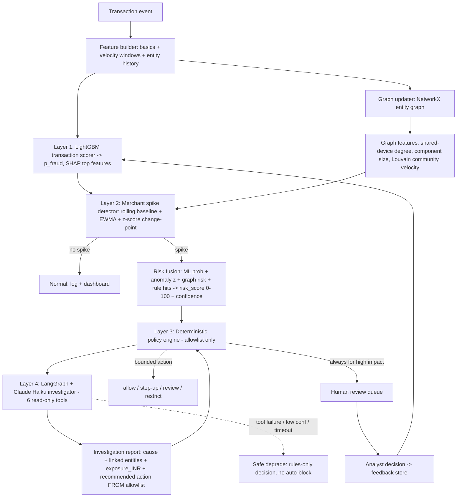

# Winning the Razorpay Buildathon Track 02 (AI Risk Manager): A Technical Strategy for "Fraud Spike Investigator"

## TL;DR
- **Build the "Fraud Spike Investigator" as designed** — a merchant-level fraud-spike detection + entity-correlation + policy-gated LLM investigation system — but sharpen it explicitly against Razorpay's *own* real risk stack (Thirdwatch per-order scoring, Shield's rules engine, and especially "Bumblebee," Razorpay's real agentic merchant-review AI). The winning wedge is the **spike → why → who → ₹ exposure → bounded action → human review** loop operating ABOVE per-order scoring, with honest false-positive economics.
- **The recommended architecture is deliberately un-flashy and matches what industry leaders actually do**: a calibrated LightGBM transaction scorer + EWMA/z-score merchant-spike detector + NetworkX graph-feature layer + a deterministic policy engine the LLM can never bypass. Skip GNNs, Kafka, Neo4j, autoencoders, and RAG — they add demo risk without shortlist value in a solo 3-day build.
- **Judges reward judgment over sophistication.** The single highest-scoring moment is the flash-sale false-positive scenario where volume spikes but network-risk does not, and the system deliberately does NOT block — proving you optimized for false-positive cost, the exact bar Track 02 sets.

## Key Findings

1. **Razorpay already ships everything EXCEPT your exact wedge.** Thirdwatch scores per-order COD/RTO risk on "300+ parameters" in "less than 200 milliseconds"; Razorpay Shield ("India's first Payment Risk Suite") runs its risk engine "against 100+ rules and dual risk scoring" (a related Razorpay blog cites ~10,000 data points per transaction); Agent Studio's Dispute Responder auto-fights chargebacks on Anthropic's Claude Agent SDK; and "Bumblebee" is a real Razorpay multi-agent AI that reviews risky *merchants*. Crucially, Bumblebee reviews merchant **websites/onboarding**, while Thirdwatch/Shield score **individual transactions** — nobody in the public stack does **real-time, transaction-stream, merchant-level fraud-spike investigation with entity correlation and ₹-exposure**. That is your defensible gap.

2. **The industry consensus validates classical ML + deterministic decisioning, not LLM classifiers.** Stripe Radar "assesses more than 1,000 characteristics of a potential transaction... in less than 100 milliseconds" and "incorrectly blocks just 0.1%" of legitimate payments; it historically combined an XGBoost "memorization" component with a deep network (dropping XGBoost would have cost 1.5% recall) before migrating to a ResNeXt-inspired DNN at Stripe-network scale. Adyen's RevenueProtect uses ML + static rules with an explicit "white box" philosophy and a Dynamic Decisioning Engine routing high-risk shoppers to 3DS/manual review. No serious system lets a generative model make the block decision.

3. **LightGBM is the correct primary model for a 3-day solo build** — fastest inference/training among gradient-boosted trees (a Riskified fraud-dataset benchmark found LightGBM the fastest of GBM/XGBoost/CatBoost; a 2025 real-time study found "LightGBM was the most advantageous in latency control"), native missing-value handling, strong on imbalanced tabular data, and SHAP-explainable. Deep tabular models (TabTransformer/FT-Transformer) and GNNs do not justify their cost here.

4. **Do NOT blindly apply SMOTE.** Peer-reviewed evidence (PLOS One 2025; the e-commerce fraud research agenda; robROSE) shows oversampling distorts feature-space and graph topology under extreme imbalance and temporal drift; the Fraud Detection Handbook and multiple 2024–2026 papers favor class weighting, calibrated probabilities (Platt/isotonic), and cost-sensitive thresholds over resampling. A Nature *Scientific Reports* 2026 study even found the best temporal-test F2 came from an MLP with **no** oversampling, and "no single oversampling method dominates."

5. **Evaluation must be temporal and cost-aware.** PR-AUC/Average Precision and **Card/Precision@k** (from Le Borgne et al.'s *Reproducible ML for Credit Card Fraud Detection* handbook) over a temporal holdout — never random k-fold — plus an explicit expected-monetary-loss framework are what a Razorpay judge will respect. The handbook explicitly warns accuracy is "a poor performance metric" (a dummy all-genuine classifier scores 0.99 on 0.1% fraud data).

## Details

### 1. Final product recommendation (one sentence)
Build **Fraud Spike Investigator**: a defense-only, merchant-level risk system that detects sudden abnormal fraud spikes in a merchant's live transaction stream, correlates the related entities (customers/devices/IPs/instruments) into a fraud-ring picture, uses a policy-gated LLM agent to explain *why* the spike is happening and estimate ₹ exposure, and recommends only bounded, allowlisted defensive actions with human review — sitting one level ABOVE Razorpay's per-order scorers (Thirdwatch/Shield) and distinct from Razorpay's onboarding-review agent (Bumblebee).

### 2. Problem statement (one paragraph)
Merchants do not lose money one transaction at a time; they lose it in **bursts** — a card-testing wave, an account-takeover cluster, a device farm, or a coordinated fraud ring — where the fraud rate on a single merchant jumps from a normal baseline to several multiples within hours. Per-order scorers flag individual bad orders but do not tell a merchant "you are *under attack right now*, here is *why*, here are the *linked entities*, here is your *₹ exposure*, and here is the *bounded action* to take." Fraud Spike Investigator closes that loop: it watches merchant-level fraud dynamics, detects the change-point, assembles the evidence, and hands a human a decision-ready investigation — without ever letting an LLM auto-block anyone.

### 3. Why this problem matters (quantified, real sources only)
- **India BFSI fraud is surging.** Per the RBI Annual Report FY25 (reported by Business Standard, May 30 2025), the *amount* involved in bank frauds jumped ~194% year-on-year, from ₹12,230 crore (FY24) to ₹36,014 crore (FY25), even as the number of cases fell 34% to 23,953. Digital payments were the single largest category by number — 13,516 cases (56.5% of all cases), involving ₹520 crore. Bloomberg, citing RBI, reported digital-payment fraud value jumped >5× to ₹14.57 billion (~$175M) in the year ended March 2024. A Government of India Lok Sabha reply (answered Aug 10, 2026) put digital-payment fraud at 5,85,751 incidents / ₹3,590.70 crore over FY2021-22 to FY2025-26. A BBC report (2026) estimated that "nearly 2.5 million people have lost some $2.5bn in 2025, a staggering 4,300% rise since 2021."
- **RTO/returns quietly eat margin.** Razorpay's own Thirdwatch materials state "RTO rates up to 40% for e-commerce merchants on an average," and that "in case of COD orders, the percentage of RTO orders can be as high as 40 percent," with RTO+fraud contributing "up to 50%" of orders; a KaratCart case study showed a 36% RTO reduction using Thirdwatch — evidence that merchant-level loss from fraud/returns is board-level in India.
- **Regulatory momentum.** RBI's April 2026 discussion paper "Exploring safeguards in digital payments to curb frauds" proposes transaction delays and mule-account monitoring — signaling that *merchant-side, spike-aware* defensive tooling is timely.
- *Assumption/label:* I do not have Razorpay production baselines; the "0.7%→5%" figures below are **simulator design parameters**, not Razorpay statistics.

### 4. Differentiation — not a generic detector, not a Thirdwatch clone
| Existing Razorpay capability (verified) | What it does | What it does NOT do (your wedge) |
|---|---|---|
| **Thirdwatch** ("300+ parameters," "<200ms," red/green flags) | Per-order COD/RTO + fraud scoring | Merchant-level spike detection, cross-entity ring correlation, ₹-exposure narrative |
| **Shield** ("100+ rules + dual risk scoring," ~10k data points/txn) | Per-transaction card-fraud/chargeback risk | "You are under attack now" change-point + investigation |
| **Bumblebee** (real multi-agent AI; ~10k–12k merchant reviews/month, flags risky merchants "in under 90 seconds") | Merchant **website/onboarding** risk review | Real-time **transaction-stream** spike investigation for already-live merchants |
| **Agent Studio Dispute Responder** (Claude Agent SDK, "auto-responds to chargebacks with optimized evidence to maximize dispute win rates") | Post-loss dispute evidence | Pre-loss spike interception |

**Positioning:** Fraud Spike Investigator is the missing **merchant-level, real-time, transaction-stream investigator** — it consumes per-order scores as *inputs*, detects the merchant-level regime change, and produces an explained, bounded, human-reviewable decision. It is complementary to Thirdwatch/Shield (uses their scores), orthogonal to Bumblebee (onboarding vs. live stream), and upstream of Dispute Responder (prevents the loss Dispute Responder would otherwise fight).

### 5. Final architecture (Mermaid)


### 6. Component-by-component explanation
- **Feature builder** — deterministic, pure-Python transforms; the single most important lever (echoing Stripe: "one of the biggest levers we have to make model improvements is through feature engineering").
- **Layer 1 (LightGBM scorer)** — per-transaction p_fraud + SHAP attributions for explainability; calibrated (isotonic) so probabilities are usable in expected-loss math.
- **Layer 2 (spike detector)** — the novel core; converts a stream of per-txn scores into a merchant-level change-point signal via EWMA + rolling z-score (online, O(1) per event, restartable). CUSUM/EWMA are the classic *online* sequential methods; PELT/Bayesian are offline and unnecessary here.
- **Graph layer (NetworkX)** — computes shared-entity degree, connected-component size, and Louvain communities to surface rings; graph *features*, not a GNN.
- **Layer 3 (policy engine)** — the safety spine: deterministic mapping from (risk_score, confidence, spike_state) to an allowlisted action; the LLM cannot write actions outside it.
- **Layer 4 (LLM investigator)** — LangGraph agent with ~6 **read-only** tools; explains, correlates, estimates ₹, recommends *from the allowlist*; never decides.
- **Human review + feedback** — synchronous HITL for high-impact actions (the pattern finance-agent guidance recommends for "irreversible actions"); analyst labels flow back for future retraining.

### 7. Data architecture (raw → serving)
Raw event → validation/idempotency check → feature builder (velocity windows via time-bucketed aggregates) → LightGBM scoring → append to per-merchant score series + entity graph → spike detector → fusion → policy → (optional) agent → SQLite/Postgres persistence (transactions, entities, edges, investigations, actions, audit) → FastAPI serving + React dashboard. Everything is single-process and replayable from a JSONL event log — **no Kafka**.

### 8. ML architecture (exact models and why)
- **Primary classifier: LightGBM** (gradient-boosted trees). Rationale from research: LightGBM leads on inference latency and training speed among GBDTs while matching XGBoost/CatBoost on AUC on large tabular fraud data; native missing-value handling; SHAP-explainable; trivial to deploy (single .txt/.pkl). ~20–25 engineered features (transaction basics, velocity windows, entity history, graph-derived features).
- **Class imbalance:** use `scale_pos_weight`/class weights + calibrated thresholds — **not SMOTE**.
- **Calibration:** isotonic regression on a temporally held-out calibration slice (Platt as fallback for tiny data), selected by Brier score, so risk_score maps to a real probability for ₹-exposure math.
- **Explicitly NOT used:** DNN/ResNeXt-style (Stripe needs it because of network scale + retrain velocity; you do not), TabTransformer/FT-Transformer (2025–2026 benchmarks show tree ensembles match/beat deep tabular models; no edge at this data size), LLM-as-classifier (slow, uncalibrated, unsafe).

**Supervised-model decision matrix (optimized for solo 3-day build + shortlist):**
| Model | Fraud perf | Imbalance | Train/infer speed | Interpretability | Deploy ease | Verdict |
|---|---|---|---|---|---|---|
| Logistic Regression | Low–Med | via weights | Fast | High | Trivial | Baseline only |
| Random Forest | Med–High | via weights | Med | Med | Easy | Backup |
| XGBoost | High | Good | Med | Med (SHAP) | Easy | Strong alt |
| **LightGBM** | **High** | **Good** | **Fastest** | **Med (SHAP)** | **Easy** | **PRIMARY** |
| CatBoost | High | Good (cats) | Med | Med | Easy | Alt if many categoricals |
| MLP | Med | needs care | Med | Low | Med | No |
| TabTransformer/FT-T | Med–High | needs care | Slow | Low | Hard | No |

### 9. Graph architecture
- **Entities (nodes):** merchant, customer, transaction, device, IP, email, phone, payment-instrument, location.
- **Edges:** customer—used—device, customer—from—IP, customer—paid_with—instrument, transaction—belongs_to—customer, plus shared-attribute projections.
- **Graph-derived features (fed to fusion, not a GNN):** shared-device fan-out/degree, connected-component size, local clustering coefficient, Louvain community id + community fraud-density, betweenness for "hub" instruments. Literature (Neo4j's IEEE-CIS graph study; graph-fraud surveys) shows these structural features materially lift PR-AUC over tabular-only and are exactly the signals that reveal device farms / IP clusters / rings — "the fraud signal only becomes apparent when analyzing the network of relationships."
- **Level chosen:** **graph-derived features + classical algorithms (Louvain, components) in NetworkX.** Node2Vec/GNN rejected: AWS's own real-time GNN blueprint requires Neptune + SageMaker + DGL + Step Functions + Glue — infeasible and un-demoable solo in 3 days, and offers no shortlist advantage over interpretable graph features.

### 10. Agent architecture (LangGraph + Claude Haiku, ~6 tools)
- **State:** merchant_id, spike_window, candidate entities, tool outputs, draft findings.
- **Tools (all read-only, schema-validated):** `get_merchant_baseline`, `get_flagged_transactions`, `get_entity_network`, `get_velocity_summary`, `calculate_exposure`, `write_investigation_report`.
- **Contract:** the agent may only *recommend* an action string that the policy engine re-validates against the allowlist; `calculate_exposure` is deterministic Python (the LLM never does the arithmetic that matters); `write_investigation_report` persists a structured, audited artifact.
- **Guardrails (OWASP LLM Top-10 + finance-agent research):** no DB writes, no network egress, tool-output validation, per-run audit log of every tool call, input sanitization against injected transaction fields, and an inline "if evidence is weak, `escalate_to_human`" behavior rather than fabricating — mirroring FinHarness's finding that agents should accumulate weak signals and self-escalate on irreversible actions.

### 11. Risk-scoring architecture (exact fusion logic)
```
p_ml      = calibrated LightGBM probability            # [0,1]
z_spike   = EWMA/z-score merchant change statistic     # standardized
g_risk    = normalized graph risk                      # e.g. sigmoid(a*log(component_size) + b*shared_device_degree)
r_rules   = fraction of hard rules violated            # [0,1]

risk_raw   = w1*p_ml + w2*squash(z_spike) + w3*g_risk + w4*r_rules   # weights sum to 1
risk_score = round(100 * risk_raw)                                   # 0..100
risk_confidence = f(data_completeness, model_margin, tool_success)   # 0..1, low if features missing/agent failed
```
- **Threshold:** cost-sensitive, not accuracy-maximizing. Choose t minimizing expected cost `E[C] = C_FN·P(FN) + C_FP·P(FP) + C_review·P(review)`, where C_FP = value of a wrongly blocked legitimate order. Research stresses amount-dependent, two-dimensional (probability × amount) thresholding for fraud.
- **Calibration options documented:** Platt scaling, isotonic regression, calibration curves + Brier/ECE — with the caveat (from the e-commerce fraud research agenda) that "adversarial concept drift" and "rapidly changing prevalence" degrade calibration, so recalibrate on recent data.

### 12. Evaluation methodology
- **Temporal holdout only:** split by time (train → validation/calibration → test), never random k-fold, to avoid leakage from future to past (Fraud Detection Handbook methodology; the Nature 2026 study kept CV folds unshuffled to preserve temporal order).
- **Leakage avoidance:** velocity/aggregate features computed strictly from data *before* each transaction's timestamp; no target-derived features; entity-history features use only past events. (Note: PaySim's balance columns are documented leakage traps — avoid them.)
- **Two clearly separated tracks:** (A) *public-data methodology demonstration* on IEEE-CIS (real, has device/IP/email fields for graphs) to prove the ML/graph pipeline; (B) *product demonstration* on the synthetic business-signal simulator for the spike/agent/exposure loop. Never present public data as Razorpay data.

### 13. Complete metrics table
| Category | Metric | Why it's here |
|---|---|---|
| Ranking | PR-AUC / Average Precision | Correct for extreme imbalance (Handbook Ch.4) |
| Ranking | ROC-AUC | Reported for comparability only (less relevant at low k) |
| Threshold | Precision, Recall, F1 | At the chosen cost-optimal operating point |
| Threshold | FPR, FNR | False-positive cost is the Track 02 bar |
| Operational | Precision@k / Recall@k (Card Precision top-k) | Investigators can only check k/day (Handbook) |
| Money | Expected monetary loss (₹) | Decision-theoretic objective |
| Money | Fraud ₹ prevented vs legitimate ₹ wrongly blocked | Honest FP economics |
| System | Inference latency (per txn), investigation latency | Real-time credibility |
| Agent | Tool-call reliability, investigation accuracy vs ground truth, policy-violation count (target 0), escalation rate | Trust + safety |

### 14. Ablation study design
Report metrics for: (1) LightGBM only → (2) + velocity features → (3) + anomaly/spike signal → (4) + graph features → (5) full system (+agent narrative). This isolates each component's contribution to PR-AUC and to ₹-loss reduction, and directly answers "why graph / why anomaly / why the agent" with numbers. If graph features don't lift PR-AUC on IEEE-CIS, **report that honestly** — judges reward the honest negative result.

### 15. Failure-recovery design (fail safe; never auto-block on LLM failure)
| Failure | Behavior |
|---|---|
| ML service down | Fall back to rules + spike detector; mark low confidence; route to review |
| Graph store down | Score without graph features (degraded); flag reduced confidence |
| DB timeout | Retry w/ backoff; serve last-good baseline; queue write |
| Malformed txn | Reject at validation; log; do not crash pipeline |
| Missing features | Impute/skip; lower confidence; never treat missing as fraud by default |
| LLM timeout/hallucination | **Risk decision still made deterministically**; investigation shows "AI unavailable"; no auto-block |
| Tool failure | Agent retries once, else returns partial report + escalate |
| Conflicting signals | Policy engine defaults to *review* (human), not block |
| Low confidence | Force human review; never auto-restrict |
| Unknown entity | Treat as new/low-history; monitor, don't punish |
| Duplicate txn | Idempotency key dedupes |
| Extreme amount | Cap influence; flag for review rather than auto-act |

### 16. Security / safety
Strict tool permissions (read-only), allowlisted actions only, deterministic policy engine as the sole action authority, full audit logs (log references/hashes not raw PII, per OWASP LLM guidance), idempotency keys, rate limits, authn/authz on endpoints, PII minimization, prompt-injection resistance (treat transaction text as untrusted; validate tool outputs), human escalation for high-impact actions, and explainability (SHAP + evidence statements). **The agent has no arbitrary DB write access** and cannot execute any action the policy engine did not authorize — the "policy-gated agent" pattern the finance-agent literature (FinHarness, AuditFlow) recommends against prompt-injection and "excessive agency" (OWASP's top-ranked LLM risk).

### 17. Tech stack (exact)
Python 3.11, FastAPI, SQLite (dev) / Postgres (optional), LightGBM, scikit-learn (calibration/metrics), NetworkX, LangGraph + Claude Haiku, React + a charting lib, Pandas/NumPy. Local Docker Compose optional for one-command run. **No Kafka, no Neo4j, no feature store, no Kubernetes, no GNN framework** — no infra added for appearance.

### 18. Repository structure
```
fraud-spike-investigator/
  README.md  ARCHITECTURE.md  METRICS.md
  data/ (sim/, public/)   notebooks/ (eval, ablation)
  src/
    api/ (fastapi app, routers, schemas)
    features/  models/ (train, calibrate, score)
    spike/ (ewma, zscore)  graph/ (build, features, louvain)
    fusion/  policy/ (engine, allowlist)
    agent/ (graph.py, tools.py, prompts.py)
    sim/ (six scenario generators)
    persistence/ (db, models, audit)
  tests/ (unit: policy, fusion, tools; integration: replay)
  frontend/ (React dashboard)
  docker-compose.yml
```

### 19. API design
- `POST /transactions` → ingest one event → returns `{txn_id, p_fraud, risk_score, spike_state, action}`.
- `GET /merchants/{id}/risk` → overview (baseline vs current fraud rate, risk_score, ₹ exposure, txns-at-risk, top cause).
- `POST /merchants/{id}/investigate` → triggers agent → returns investigation report.
- `GET /investigations/{id}` → full report + entity network + evidence + recommended action.
- `GET /review-queue` / `POST /review/{id}/decision` → HITL.
- Tool interfaces = typed pydantic schemas; every tool call audited.

### 20. Database schema (core tables)
`merchants(id, baseline_fraud_rate, ewma_state, ...)`; `transactions(id, merchant_id, customer_id, device_id, ip, instrument_id, amount, ts, p_fraud, risk_score, action)`; `entities(id, type, first_seen, history_stats)`; `edges(src, dst, type, ts)`; `investigations(id, merchant_id, window, cause, exposure_inr, recommended_action, confidence, created_at)`; `actions(id, ref, action, source=policy, authorized_by)`; `audit_log(id, actor, tool, inputs_hash, output_hash, ts)`; `review_queue(id, ref, status, analyst_decision)`.

### 21. UI specification (judge-facing dashboard)
- **Merchant risk overview:** large fraud-rate delta (e.g., 0.8% → 4.7%), risk_score /100 gauge, estimated ₹ exposure, transactions-at-risk count, top-cause banner.
- **Investigation timeline:** spike detected → entities correlated → cause identified → exposure computed → action recommended → routed to human.
- **Entity graph view:** interactive nodes/edges highlighting the shared device/IP/instrument ring.
- **Evidence statements:** plain-English bullet facts (each tied to data) + SHAP top features (Stripe-style "risk insights").
- **Decision + recommended action:** allow/step-up/review/restrict, clearly marked "recommended, pending human review."
- **Explainability panel:** why this score, the confidence, and what would change it.

### 22. 3-minute demo script
1. **Normal merchant (0:00–0:30):** dashboard green, fraud rate ~0.8%, no spike.
2. **Inject fraud spike (0:30–1:00):** replay device-farm + IP-cluster scenario; per-txn scores climb.
3. **Real-time detection (1:00–1:20):** EWMA/z-score fires; risk_score jumps; "under attack" banner; ₹ exposure updates live.
4. **Graph appears (1:20–1:40):** one device → ~50 accounts → shared instruments lights up.
5. **Agent investigates (1:40–2:20):** LangGraph agent calls tools, identifies cause ("coordinated device-farm card-testing ring"), computes exposure deterministically, recommends *review/restrict* from the allowlist → routed to the human queue; investigation report shown.
6. **The money moment — false positive (2:20–3:00):** inject the **flash-sale** scenario. Volume spikes hard, the spike detector notices unusual volume — but ML fraud probability and graph network-risk do NOT rise. The system explicitly **does not block**, labels it "legitimate high-volume event," and explains the decision. *This is the AI-judgment climax the judges are grading, and it directly demonstrates the Track 02 false-positive-cost bar.*

### 23. Build plan (P0/P1/P2/P3)
- **P0 (must):** simulator (6 scenarios) + feature builder + LightGBM + temporal eval + spike detector + policy engine + minimal dashboard + false-positive scenario.
- **P1:** graph features + fusion + ₹-exposure + ablation table + calibration.
- **P2:** LangGraph agent + 6 tools + investigation report + audit log + HITL queue.
- **P3:** polish (entity-graph viz, README/ARCHITECTURE, Docker one-command, extra scenarios).

### 24. 24-hour version
Simulator (fraud-spike + flash-sale scenarios only) + LightGBM + EWMA spike detector + deterministic policy engine + a single-page dashboard showing spike detection and the no-block flash-sale decision + temporal PR-AUC and FP-cost numbers. No agent, no graph yet — but already demonstrates the core thesis and honest metrics.

### 25. 48-hour version
Add graph features + fusion + ₹-exposure + ablation study + calibrated thresholds + the LangGraph agent with 3–4 tools producing an investigation narrative + audit logging + HITL queue. This is the shortlist-competitive build.

### 26. "Do NOT build" list (confirmed via research)
- **GNNs** (Neptune/DGL/SageMaker/Glue/Step-Functions needed; no solo-3-day path; graph *features* capture the same rings).
- **Kafka / streaming infra** (single-process replay is enough and more demoable).
- **Neo4j** (NetworkX suffices at demo scale).
- **Autoencoders/VAEs** (harder to calibrate/explain; EWMA + LightGBM beat them for effort/value here).
- **RAG** (no corpus that materially helps; adds a failure surface).
- **Kubernetes/microservices/feature store** (appearance, not substance).
- **SMOTE** (distorts distribution under imbalance/drift; use class weights + calibration).

### 27. The 10 hardest judge questions (with answers)
1. **Why does this need to exist?** Per-order scorers (Thirdwatch/Shield) flag orders; nobody tells the merchant "you're under attack now, here's why/who/₹/action." Bursts are how merchants actually lose money.
2. **Why not just a dashboard?** A dashboard shows charts; this *detects the change-point, correlates entities, quantifies exposure, and recommends a bounded action with an audit trail* — decision-ready, not chart-ready.
3. **Why ML (not rules)?** Rules miss novel patterns and drift; LightGBM generalizes and is SHAP-explainable. But rules still gate the decision — belt and suspenders (the Adyen ML-plus-rules pattern).
4. **Why graph?** Device farms/IP clusters/rings are invisible per-transaction; shared-entity degree, component size, and Louvain communities expose them (validated by Neo4j's IEEE-CIS PR-AUC lift).
5. **Why an agent?** To turn signals into a human-readable *investigation* (cause + evidence + exposure) fast — the verification bottleneck Razorpay itself frames with Bumblebee.
6. **Why shouldn't the LLM decide?** LLMs are uncalibrated, injectable, and non-deterministic; finance-agent research (FinHarness/OWASP "excessive agency") shows tool-using agents fail on irreversible actions. The deterministic policy engine decides; the LLM only explains/recommends.
7. **Measurable business impact?** Fraud ₹ prevented vs legitimate ₹ wrongly blocked, expected-loss reduction, precision@k, and time-to-detect the spike.
8. **Difference from Thirdwatch/Shield/Stripe Radar?** They score transactions in <200ms/<100ms; this investigates merchant-level *spikes* above them and is complementary (consumes their scores as inputs).
9. **What's hard to reproduce?** The honest false-positive discipline (flash-sale no-block), the temporal-holdout + cost-sensitive evaluation, and the policy-gated safe-degrading agent — judgment, not just code.
10. **30-second pitch?** "Merchants lose money in bursts, not drips. Fraud Spike Investigator detects the burst in real time, shows you the ring behind it, tells you your rupee exposure, and recommends a bounded action — and when a flash sale spikes volume without fraud, it deliberately does nothing. An LLM explains; it never decides."

### 28. Final shortlist self-scoring (1–10) + fixes
| Dimension | Score | Weakness → Fix |
|---|---|---|
| Problem importance | 9 | Tighten to one loss class (card-testing/ring) for crispness |
| Originality | 8 | Must clearly out-position Bumblebee (onboarding vs live stream) |
| Technical depth | 8 | Show ablation + calibration to prove depth |
| AI judgment | 10 | The flash-sale no-block is the differentiator; rehearse it |
| Build quality | 8 | Tests on policy/fusion + one-command run |
| Measurability | 9 | Lead with PR-AUC, precision@k, ₹ FP-cost |
| Demo quality | 9 | Script the 6-scene demo tightly to 3 min |
| Business impact | 8 | Put ₹ prevented vs ₹ wrongly blocked front-and-center |
| Feasibility (solo/3d) | 9 | Follow P0→P3; agent is P2 so it's cuttable |
| Razorpay relevance | 9 | Uses Claude (like Agent Studio); complements Thirdwatch/Shield |

**Overall: a shortlist-strong build if the false-positive discipline and honest temporal metrics are foregrounded.**

### Synthetic data generation spec (grounded in the Fraud Detection Handbook approach)
A controllable simulator (à la the handbook's transaction simulator: customers, terminals/merchants, timestamped transactions with injected fraud scenarios) generating six labeled scenarios:
1. **Fraud spike:** baseline ~0.7% fraud rising to ~5% over a window (change-point ground truth).
2. **Device farm:** one device_id → ~50 accounts → several instruments (high shared-device degree).
3. **IP cluster:** one IP/subnet → many accounts → abnormal velocity.
4. **Account takeover:** established customer → sudden new device + new geo + unusual amount.
5. **Coordinated ring:** multiple accounts sharing devices/IPs/instruments (dense component / Louvain community).
6. **Legitimate flash sale:** large volume spike, normal per-txn fraud probability, no shared-entity anomaly — **must NOT be flagged.**

Each scenario emits ground-truth labels + a ground-truth "cause" so agent accuracy and spike-detection lead time are measurable. Critical design note (from 2026 synthetic-data research): row-independent generators "cannot reproduce cross-row co-occurrence structure by construction" — so the simulator must **explicitly wire shared entities** (devices/IPs/instruments reused across accounts) rather than sampling them independently, or the fraud rings will not exist in the graph.

## Recommendations
1. **Lock the concept; do not replace it.** Research confirms the wedge (merchant-level, real-time, transaction-stream spike investigation) is unoccupied in Razorpay's public stack. Sharpen the pitch against Bumblebee (onboarding) and Thirdwatch/Shield (per-order).
2. **Ship P0 in the first day** to guarantee a working demo with honest metrics even if the agent slips.
3. **Foreground false-positive economics** — make the flash-sale no-block the centerpiece and report ₹ wrongly blocked, not just recall.
4. **Use LightGBM + isotonic calibration + cost-sensitive threshold; skip SMOTE, GNNs, Kafka, Neo4j, RAG.**
5. **Evaluate temporally** with PR-AUC + precision@k on both a public dataset (IEEE-CIS, for methodology) and the simulator (for product), clearly separated.
6. **Make the agent policy-gated and safe-degrading**; demonstrate an LLM-failure path where risk decisions still work and nothing auto-blocks.

**Thresholds that change the plan:** if the agent (P2) is unstable by hour ~40, cut it and ship the deterministic system + templated narrative; if graph features don't lift PR-AUC in the ablation, present that honestly; if simulator realism is weak, lean harder on IEEE-CIS for the ML/graph metrics while keeping the simulator for the spike/agent demo.

## Caveats
- All Razorpay figures (Thirdwatch "300+"/"<200ms", Shield "100+ rules"/dual scoring/~10k data points, Bumblebee timings, ACS "~95%") are **company-stated marketing/engineering claims**, not independently audited; the Bumblebee "88%→99% accuracy uplift" appears verbatim only in a secondary recruiting blog (faceprep.in) — the "88%" in Razorpay's primary engineering post actually describes an *earlier* architecture phase, so treat the "99%" number cautiously. Razorpay's own DEV post confirms the "10,000–12,000 monthly reviews / 700–800 human hours / under 90 seconds" figures.
- The "0.7%→5%" fraud rates and device-farm/account counts are **simulator parameters**, not Razorpay data; I claim no access to Razorpay production data or internal APIs.
- Stripe/Adyen/AWS architecture details come from official engineering posts, docs, and reputable press but describe systems far larger than a hackathon build; they inform design lessons, not one-to-one replication.
- Public-dataset limits: ULB Credit Card is PCA-anonymized (28 unnamed components; no real entities usable for graphs); PaySim has documented balance-column leakage; IEEE-CIS (~590,540 transactions, ~3.5% fraud, with device/IP/email fields) is the best public choice for demonstrating the graph-feature pipeline.
- The Stripe "38% average fraud reduction" and "$1.4 trillion annual payment data" figures are from Stripe's own marketing pages and reflect Stripe-network scale, not a hackathon-achievable benchmark.